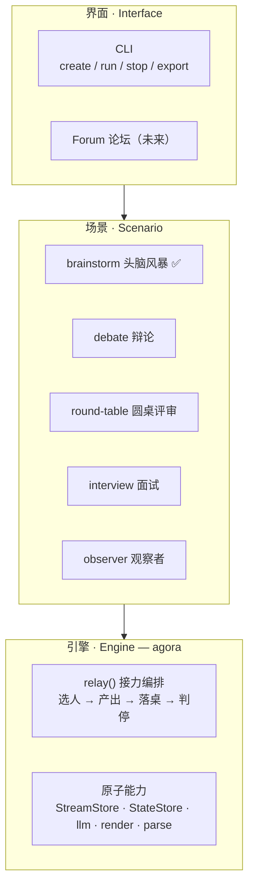
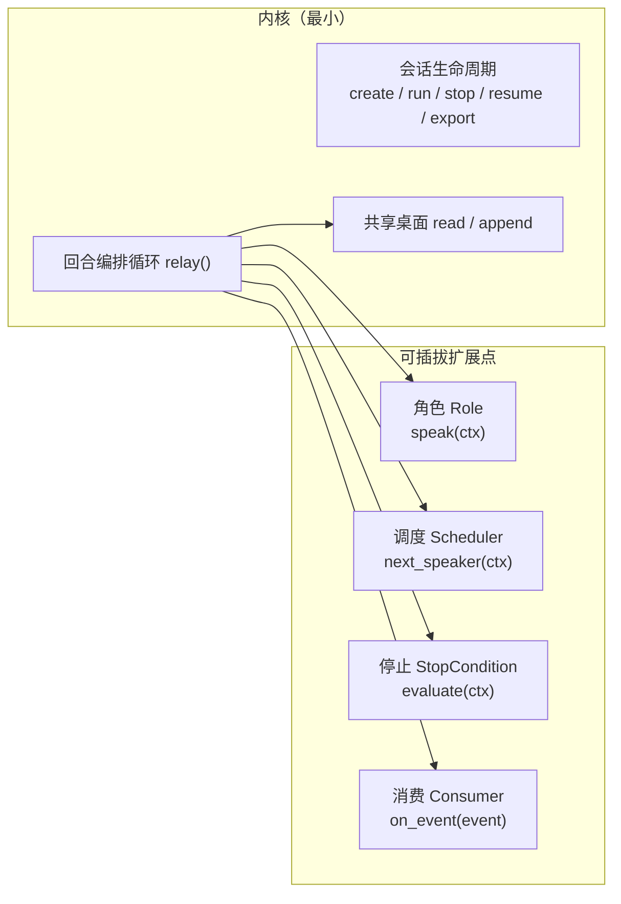
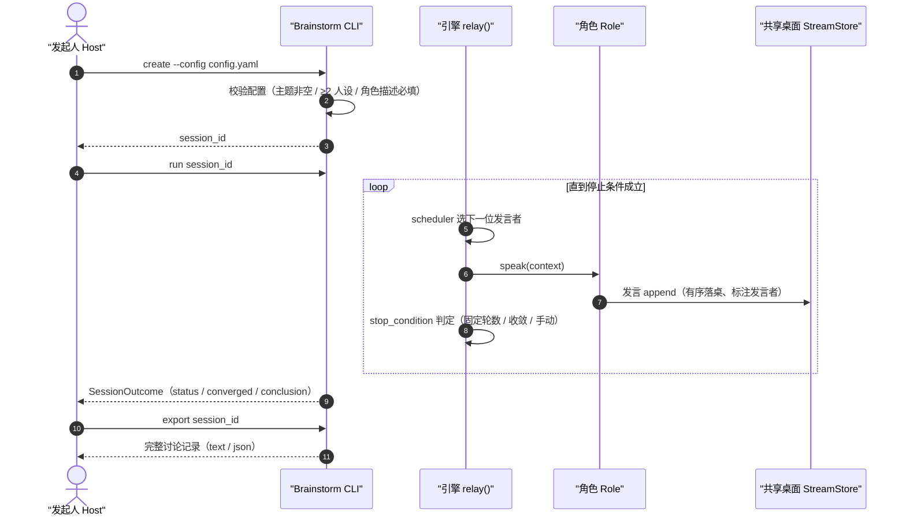
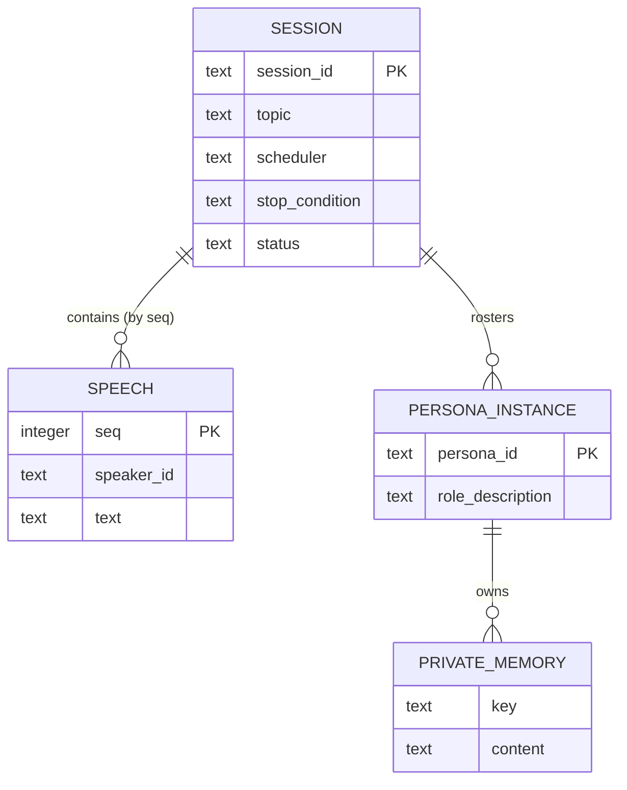

# Agora

> 一个可复用的 **多方接力协作引擎**：让多个 AI 角色围绕一个主题，按可配置的顺序轮流产出一条消息，落到一张所有人可见、有序、可持久化的共享桌面上，按可配置的条件停止 —— 角色、顺序、停止、界面全部可插拔。

[](https://www.python.org/)
[]()
[]()
[]()

---

## 目录

1. [一句话定位](#一句话定位)
2. [三层模型](#三层模型)
3. [架构概览](#架构概览)
4. [快速开始](#快速开始)
5. [运行原理](#运行原理)
6. [数据模型](#数据模型)
7. [核心能力](#核心能力)
8. [项目结构](#项目结构)
9. [Roadmap](#roadmap)
10. [文档](#文档)

---

## 一句话定位

现有 Agent 框架已经提供了「循环（Loop）」「记忆（Memory）」「命名空间隔离」与 LLM 适配，多人设也能并行作答 —— 缺的是一条 **共享、按序** 的协作循环。Agora 补上的正是这块：多方围绕一个主题、按顺序接力、人人可见、可收敛。

价值在于把这条循环做成 **可复用的引擎**：头脑风暴只是它的第一个场景，后续「辩论 / 圆桌 / 面试 / 论坛」都是同一引擎上的不同配置，而不是各写一套。

## 三层模型

为避免「forum 既是界面又是引擎」的混用，项目把概念拆成三层，各有一个名字：

| 层 | 是什么 | 名字 | 状态 |
|---|---|---|---|
| **引擎** | 接力协作内核（有序接力、持久化、恢复、原子能力 + 声明式配置） | **`agora`**（＝ 本仓库名） | 半成品：brainstorm 内已有一份，未抽成通用层 |
| **场景** | 引擎上的一类具体应用 | `brainstorm` / `debate` / … | `brainstorm` 已交付 |
| **界面** | 人怎么和场景交互 | `cli`（已有）/ `forum`（未来） | `cli` 已有 |



## 架构概览

引擎是「**稳定内核 + 可插拔扩展点**」：内核只做会话生命周期与回合编排循环，角色、调度策略、停止条件、消费界面都是扩展点。默认实现装配时注册，新能力经同一注册点接入 —— **0 处内核改动**。



四个扩展点（`contracts/public-api.md` §4）：

| 扩展点 | 职责 | 默认实现 |
|---|---|---|
| `Role` | 产出一条发言 | `PersonaRole`（weave + `FakeLLM`） |
| `Scheduler` | 决定下一位发言者 | `round_robin` / `moderator` |
| `StopCondition` | 判定何时结束 | `fixed_rounds` / `convergence` / `manual` |
| `Consumer` | 订阅进度事件（仅观测） | — |

## 快速开始

依赖 weave 框架与 PyYAML（默认离线运行，无需 API Key）：

```bash
pip install -e ../13_weave     # weave 0.1.0（唯一外部框架依赖）
pip install -e .               # agora（brainstorm 包）
```

声明式配置（改 YAML 即改话题 / 人设 / 策略 / 停止条件，无需改代码）：

```yaml
# config.yaml
topic: "如何提升留存"
personas:
  - {persona_id: product, name: 产品视角, role_description: "关注用户价值与留存漏斗"}
  - {persona_id: tech,    name: 技术视角, role_description: "关注实现可行性与稳定性"}
scheduler: round_robin          # round_robin | moderator
stop_condition:
  type: fixed_rounds            # fixed_rounds | convergence | manual
  max_speeches: 6
```

```bash
# 1. 创建会话（--config 与 --topic/--personas 二选一）
brainstorm create --config config.yaml

# 2. 运行到停止条件成立（未跑完自动恢复）
brainstorm run <session-id>

# 3. 手动停止（manual 停止条件时，best-effort）
brainstorm stop <session-id>

# 4. 导出讨论记录
brainstorm export <session-id>              # 文本：seq. speaker: text
brainstorm export <session-id> --format json   # JSON：Speech[]
```

退出码：`0` 成功；`1` 领域拒绝（带错误 `code`，如 `session.topic_required`）；`2` CLI 用法错误。

## 运行原理

一场会话从创建到导出，内核按「选人 → 产出 → 落桌 → 判停」的循环接力推进：



关键保证：

- **共享桌面**：append-only、有序（`seq` 单调）、人人可见 —— 后续发言建立在完整讨论之上。
- **隔离**：会话之间、人设之间按 namespace **构造隔离**，越界不可达。
- **恢复**：崩溃后 `resume` 恢复到中断那一轮，已落桌发言不重放。
- **事件仅观测**：进度事件（`turn_started` / `speech_landed` / `stopped`）供 `Consumer` 订阅，不承载控制流。

## 数据模型

**No schema change** —— 持久化复用 weave 现成的 `memory_entries` KV 表，不新建表、列、索引，也不写迁移。领域实体经 `namespace` + `access_type` + `key` 映射到这张通用表：



> 上图为**逻辑模型**；物理上所有实体都落在一张 `memory_entries` 表里（`FK` 仅为逻辑归属，无参照完整性）。隔离由 namespace 字符串约定保证。

| 实体 | namespace（`access_type`） |
|---|---|
| 会话状态 SESSION | `brainstorm:{session_id}:state` |
| 共享桌面 SPEECH | `brainstorm:{session_id}:stream` |
| 人设私有记忆 PRIVATE_MEMORY | `persona:{session_id}:{persona_id}:stream\|state` |
| 系统事件（跳过 / 无效选择） | `brainstorm:{session_id}:events:stream` |

## 核心能力

引擎的**功能**是一组收敛的原子，写一次、复用于所有场景（详见 [idea-brief §5](docs/idea-brief.md)）：

| 能力 | 原子 |
|---|---|
| 会话生命周期 | `create` / `run` / `stop` / `resume` / `export` |
| 接力编排 | `relay()` —— 选人 → 产出 → 落桌 → 判停 |
| 共享记录 | `StreamStore` —— append-only、有序、标注参与者 |
| 发言产出 | `render` + `llm` + `parse` |
| 顺序决策 | `round_robin` / `llm_pick` |
| 停止决策 | `fixed_rounds` / `llm_verdict` / `manual` |
| 私有记忆 | `StateStore`（per-participant ns） |
| 观测 | `observers` / 事件 |
| 持久化 / 恢复 | `StreamStore` + `resume` |
| 声明式配置 | config schema —— YAML 描述场景，零代码切换 |

## 项目结构

```
agora/
├── brainstorm/                 # 场景 1：头脑风暴（库 + CLI）
│   ├── business/               # 领域类型、错误哨兵、四扩展点协议（零 weave 依赖）
│   ├── engine/                 # 会话生命周期、回合编排、共享桌面、停止
│   ├── extensions/             # 默认调度 / 停止条件（round_robin、moderator、fixed_rounds、convergence、manual）
│   ├── weave_adapter/          # weave 接入点：人设生成（PersonaRole）、记忆仓储（Repository）
│   ├── cli/                    # create / run / stop / export
│   ├── config_loader.py        # 声明式 YAML 配置
│   ├── wiring.py               # 默认装配
│   └── README.md               # 包用法（本文是项目级 README，不重复正文）
├── tests/                      # 单测 + 集成 + 契约 + e2e + NFR（63 通过）
├── docs/                       # SDD 文档
│   ├── idea-brief.md           # 项目愿景（三层模型 / 场景 / 原子 / 顺序）
│   ├── roadmap.md              # 增量步骤与依赖
│   └── features/brainstorm/    # spec / sad / 数据模型 / 契约 / ADR / changelog
├── pyproject.toml
└── .gitignore
```

## Roadmap

| # | 步骤 | 大小 | 依赖 | 状态 |
|---|---|:---:|---|
| 1 | **头脑风暴引擎**（场景 1 · CLI） | M | — | ✅ shipped |
| 2 | **引擎泛化**：`agora` 接力层 + 原子接口 + 声明式配置 | L | 1 | idea |
| 3 | **论坛界面**（Web 表面） | M | 2 | idea |
| 4 | **辩论场景**（零代码配置） | S | 2 | idea |
| 5 | **观察者角色**（不发言 · 总结/评分） | S | 2 | idea |

依赖方向 `1 → 2 → {3, 4, 5}`；步骤 3/4/5 代码区互不相交、可并行。详见 [roadmap.md](docs/roadmap.md)。

## 文档

| 文档 | 内容 |
|---|---|
| [idea-brief](docs/idea-brief.md) | 项目愿景、三层模型、能力原子、交付顺序 |
| [roadmap](docs/roadmap.md) | 增量步骤、依赖图、执行泳道 |
| [spec](docs/features/brainstorm/spec.md) | brainstorm 需求与 20 条验收标准（AC） |
| [sad](docs/features/brainstorm/sad.md) | 架构（Arc42 + C4） |
| [data-model](docs/features/brainstorm/data-model.md) | 逻辑数据模型与 namespace 约定 |
| [contracts](docs/features/brainstorm/contracts/public-api.md) | 引擎操作 / CLI 契约 |
| [ADR](docs/features/brainstorm/adr/) | 关键架构决策 0001–0006 |
| [changelog](docs/features/brainstorm/changelog.md) | brainstorm 交付说明 |

## 开发

```bash
python -m pytest -q              # 单测 + 集成 + 契约 + e2e + NFR
ruff check brainstorm tests      # lint
mypy brainstorm                  # 类型检查
```

## License

未指定（TODO）—— 建议在仓库中加入 MIT 或 Apache-2.0 `LICENSE` 文件。
