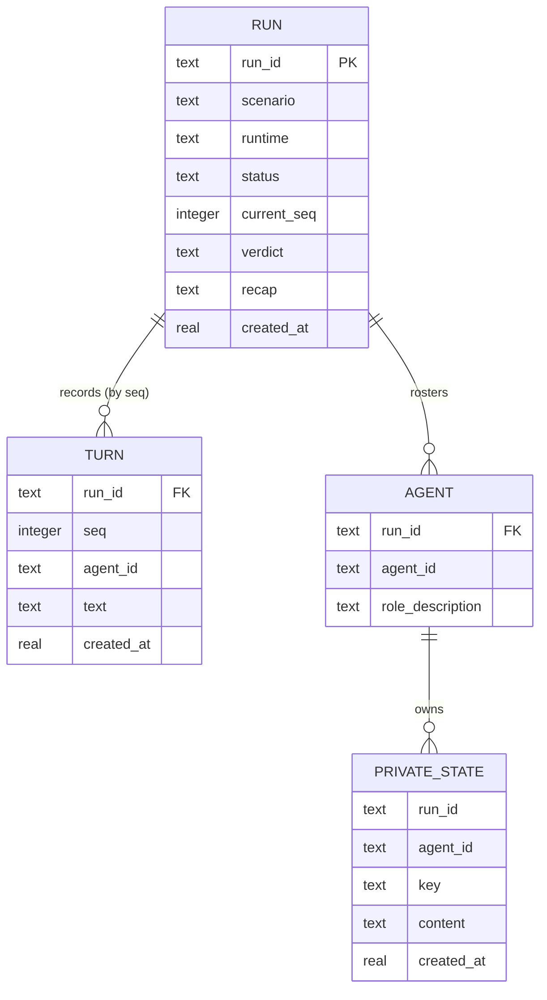

# Data model — agora

> **No schema change.** 本特性的持久化复用 weave 现成的 `memory_entries` 单表（SAD §2/§4 + ADR-0006），不新建表、列、索引，也不写迁移。本文件记录的是**逻辑数据模型**——Run / Turn / Agent / 私有状态这些领域实体如何映射到这一张通用的 KV 表（经 `namespace` + `access_type` + `key` 区分），并把 brainstorm 的命名空间根 `brainstorm:`/`persona:` 中性化为 `agora:*`、实体词汇 Session/Speech/Persona 中性化为 Run/Turn/Agent（SAD §2/§5，本轮已确认）。零迁移是合法结果，不是缺失（→ size-matrix `data-model` fast lane「no schema change」）。

## Physical table（复用，非本特性新建）

`memory_entries` 由 weave SQLite 后端在首次连接时 `CREATE TABLE IF NOT EXISTS` 自建（`weave/memory/backends/sqlite.py`）。本特性**不**迁移它：

| Column | Type | Constraints | Notes |
|---|---|---|---|
| `id` | TEXT | PK, app-generated (uuid4) | 每条记录的唯一 id |
| `namespace` | TEXT | NOT NULL | 隔离维度；本特性用它区分 run / agent / 共享转录 / 状态 |
| `access_type` | TEXT | NOT NULL | `stream` \| `state` \| `knowledge`；本特性只用前两者 |
| `key` | TEXT | — | 仅 `state` 用；stream 为 NULL |
| `content` | TEXT | NOT NULL | JSON 字符串（领域实体的载体） |
| `metadata` | TEXT | DEFAULT `'{}'` | JSON 字符串；可选标注 |
| `created_at` | REAL | NOT NULL | Unix 时间戳（float） |
| `expires_at` | REAL | — | NULL = 永不过期；TTL 用 |

## ER diagram

<!-- 逻辑模型：实体与所有权关系。物理上这些实体都落在上面那张 memory_entries 表里（见 §Entities 的 Storage 列）。 -->

> 注：`PK` / `FK` 仅为**逻辑归属**标注——KV 表无参照完整性；隔离由 namespace 字符串约定保证（spec §6.1，ADR-0006）。类型用 SQLite 词汇（`text`/`integer`/`real`），JSON 字段以 TEXT 存 JSON 字符串。

## Namespace scheme（中性化，ADR-0002）

weave 把 namespace 的**最后一个** `:`-分段解析为 access type（`stream` / `state` / `knowledge`），因此每个 namespace 必须以合法的 access type 结尾。brainstorm 的两条根 `brainstorm:{session_id}:*`（共享）与 `persona:{session_id}:{persona_id}:*`（私有）在此统一收敛为单根 `agora:{run_id}:*`（SAD §2「根前缀中性化，取代硬编码的 `brainstorm:`/`persona:`」）：

| Builder | Namespace | 用途 |
|---|---|---|
| `run_stream_ns(run_id)` | `agora:{run_id}:stream` | 共享转录（TURN 追加，append-only） |
| `run_state_ns(run_id)` | `agora:{run_id}:state` | run 状态（config / status / verdict / recap） |
| `run_events_ns(run_id)` | `agora:{run_id}:events:stream` | 系统观测事件（无效选择 / 裁判解析失败），与转录分道 |
| `agent_stream_ns(run_id, agent_id)` | `agora:{run_id}:{agent_id}:stream` | agent 私有 append-only 便签 |
| `agent_state_ns(run_id, agent_id)` | `agora:{run_id}:{agent_id}:state` | agent 私有 keyed 状态（摘要等） |

> 保留段注意：`events` 是 run 作用域下的保留分段——`agent_id` 不得取 `"events"`，否则与系统事件 namespace 撞名（同 brainstorm 的 `:events:stream` 落点约定）。agent_id 来自配置 `roles[].id`，由场景作者命名，配置校验（ADR-0005）可将 `events` 列为保留字。

## Entities

### RUN

**Aggregate root**（根）。一次接力会话实例：创建时定格的配置快照（场景配置 + 运行时值）+ 共享转录 + 终止产物。

**Storage:** `memory_entries` 行，`access_type='state'`，`namespace = agora:{run_id}:state`。按 `key` 分四个关注点：

| State key | Content (JSON) | Mutable? | Notes |
|---|---|---|---|
| `config` | `{"scenario": {"name": str, "roles": [{"id": str, "prompt": str, "inject": [...], "window": int, "output": "free_text"\|"pick_next"\|"verdict"}], "select": {"type": "round_robin"\|"llm_pick", "role": str\|null}, "stop": {"type": "fixed_rounds"\|"llm_verdict"\|"manual", "max": int\|null, "judge": str\|null}, "summary": {"role": str, "key": str, "window": int}\|null}, "runtime": {"topic": str, "stance": str\|null, ...}}` | 否 | 创建时写一次（ADR-0006 快照，场景配置与运行时值折叠在同一个不可变快照里）；resume 读快照、不重读磁盘配置（AC-15） |
| `status` | `{"status": "running"\|"stopped", "current_seq": int, "last_agent_id": str\|null}` | 是 | 每轮落桌后更新 `current_seq`；终止时置 `stopped` |
| `verdict` | `{"converged": bool, "conclusion": str\|null}` | 是 | 仅裁判收敛路径写（AC-08）；固定条数 / 条数上限未收敛 / 手动停止路径**不写** |
| `recap` | `{"termination": "converged"\|"fixed_rounds"\|"cap_unconverged"\|"manual", "recap": str}` | 是 | **任意**终止路径都写（AC-08/09/10b/11）；`cap_unconverged` 标注「未收敛」、`manual` 标注「手动停止」 |

**Logical columns:**

| Field | Type | Storage | Notes |
|---|---|---|---|
| `run_id` | TEXT (UUID) | namespace + `config` | 引擎生成 uuid4，匹配 weave `id` 约定（SAD §8 ID strategy） |
| `scenario` | JSON | `config.scenario` | 场景配置快照（roles/select/stop/summary），schema 沿用 `atomic-relay.md` §2 / ADR-0003 |
| `runtime` | JSON | `config.runtime` | 运行时值（topic/stance 等，每场会话注入）；与 scenario 同属一个快照、一起定格 |
| `status` | TEXT | `status.status` | `running` / `stopped` |
| `current_seq` | INTEGER | `status.current_seq` | 单调递增；下一 turn 的序号 |
| `verdict` | JSON | `verdict` | 裁判收敛判断（仅 `llm_verdict` 且宣告收敛时存在） |
| `recap` | JSON | `recap` | 全局复盘 + 终止方式标注（任意终止路径） |
| `created_at` | REAL | `memory_entries.created_at` | 行级时间戳 |

**Constraints:** 无 DDL 约束（KV 表不建 CHECK/FK）。主题非空、角色描述必填、select/stop 引用已知能力等不变式在应用层强制（AC-02/03/04/13，ADR-0005）。config 快照不可变（创建后不更新）。

### TURN

**Storage:** `memory_entries` 行，`access_type='stream'`，`namespace = agora:{run_id}:stream`。共享转录即该 namespace 下的全部 stream 行，按 `seq` 升序（并列时 `created_at` 兜底）。

**Content (JSON):** `{"seq": int, "agent_id": str, "text": str}`

| Field | Type | Storage | Notes |
|---|---|---|---|
| `run_id` | TEXT (UUID) | namespace | 作用域 |
| `seq` | INTEGER | `content.seq` | **显式 run 内单调序号**（已确认）；「0 丢失/重复、追加顺序」不变量的载体 |
| `agent_id` | TEXT | `content.agent_id` | 发言者 agent id（AC-05 标注发言者；系统标注，不以内容自称为准，spec §6.1） |
| `text` | TEXT | `content.text` | 发言正文 |
| `created_at` | REAL | `memory_entries.created_at` | seq 并列时的兜底排序 |

**Aggregate root:** Run。**Access patterns:** 读完整转录（`WHERE namespace=? AND access_type='stream' ORDER BY created_at`，取回后按 `seq` 排）→ `idx_ns_at`；追加 → `stream_append`。**Constraints:** `seq` 严格单调（应用层保证）；同一 turn 内不二次追加（AC-06 每 turn 恰好一条）。

### AGENT

同一「角色定义」在某个 run 里的实例。身份 = `(run_id, agent_id)`。

**Storage:** 无独立行——物化为 `RUN.config.scenario.roles[]` 的条目。其**私有状态**（PRIVATE_STATE）才有自己的行。

| Field | Type | Storage | Notes |
|---|---|---|---|
| `run_id` | TEXT (UUID) | 归属的 run | run 作用域 |
| `agent_id` | TEXT | `config.scenario.roles[].id` | 角色 id |
| `role_description` | TEXT | `config.scenario.roles[].prompt`（及注入的 `{name}`/`{role_description}`） | AC-04 必填（产出所需描述） |

**Aggregate root:** Run（roster 归属 Run；私有状态归属本实例）。角色的完整配置字段（`prompt`/`inject`/`window`/`output`）属 `config/schema.py` 的职责（SAD §5），本模型只锁定其身份与私有状态的归属。

### PRIVATE_STATE

agent 私有、他人不可见的记忆/便签（US-06 / AC-12；摘要原子填充）。

**Storage:** `memory_entries` 行，`namespace = agora:{run_id}:{agent_id}:stream`（便签，append-only）或 `namespace = agora:{run_id}:{agent_id}:state`（带 `key` 的私有状态，如摘要）。

| Field | Type | Storage | Notes |
|---|---|---|---|
| `run_id` | TEXT (UUID) | namespace | **run 作用域**（同一角色定义跨 run 隔离，AC-16/17） |
| `agent_id` | TEXT | namespace | |
| `key` | TEXT | `key`（仅 state） | 私有状态的键（如 `summary`） |
| `content` | JSON | `content` | 私有便签/状态内容 |
| `created_at` | REAL | `memory_entries.created_at` | |

**Aggregate root:** Agent（scoped within Run）。**Access patterns:** 按 namespace 读 → `idx_ns_at` / `idx_ns_key`。**隔离:** 他人不可见——读路径只带本 agent 的 namespace（spec §6.1 越界拒绝，AC-16/17）。

### System records（观测事件，非转录）

AC-07b 的「无效选择」与 OQ4 的「裁判解析失败」是系统**观测事件**，不是发言——不应污染共享转录（AC-05 转录 = 发言）。存为 `stream` 行于独立 namespace `agora:{run_id}:events:stream`（weave 把 namespace 末段当 access_type，落点需以 `:stream` 结尾、不能是字面 `:events`），`content = {"type": "invalid_choice"|"verdict_parse_failure", "agent_id": str, "reason": str}`。append-only、可查询，但不在读转录的路径上。

> 与「进度事件」的区分：AC-18 的进度事件（回合开始 / 发言落桌 / 收敛 / 停止）是进程内发布-订阅（Flow 11，无 data-store 参与者），**不持久化**；本节的观测事件是「记录」性质的系统记录，落盘。

## Indexes

复用 weave 已建的三个索引（`sqlite.py:INDEXES_SQL`），**无新增索引**：

| Index | Columns | Query it serves |
|---|---|---|
| `idx_ns_at` | `(namespace, access_type)` | 读完整转录（`WHERE namespace='agora:{run_id}:stream' AND access_type='stream' ORDER BY created_at`）；按 namespace 读私有记忆 |
| `idx_ns_key` | `(namespace, access_type, key)` | 读 run 状态（`WHERE namespace='agora:{run_id}:state' AND access_type='state' AND key=?`）；读 agent 私有 state |
| `idx_ns_expires` | `(namespace, expires_at)` | TTL 清理（若 scope 配置 ttl） |

> `seq` 排序是**应用层**（取回后 `ORDER BY seq`），无 DB 索引——因为 `seq` 在 JSON content 里，无列可索引（「no schema change」的直接后果）。若未来长会话的 `seq` 排序成为热点，加一列 `seq INTEGER` + 索引是逃生门（届时才是 schema change，本特性不做）。

## Test fixtures

测试夹具以工厂函数形式（Python，本仓库测试用；**不进 migrations/**）。PII 护栏：仅 `example.test` / 占位名。

- `make_run(run_id=None, topic="示例主题", scenario=..., runtime=...)` — 构造一个 `config` 快照状态的 JSON（scenario + runtime）。
- `make_agent(agent_id="Test Agent", role_description="示例角色")` — 构造 roster 条目。
- `make_turn(seq, agent_id, text)` — 构造一条 turn content JSON（含 `seq`）。
- `make_memory_entry(namespace, access_type, key, content, created_at=...)` — 构造一条 `memory_entries` 行，供 DB 级测试。
