# Software Architecture Document — agora

<!-- 12 Arc42 sections. Empty section → <!-- N/A: <one-line reason> -->. -->
<!-- C4 Context (L1) lives inline in §3. C4 Container (L2) lives inline in §5. -->
<!-- Numbers in §10 come VERBATIM from spec.md §6 NFR — no inventing, no rounding. -->

## 1. Introduction and goals

**Intent.** agora 是「多方接力协作引擎」的**引擎层泛化**：把 brainstorm 里已被证明可行的「多角色按序接力 + 共享转录 + 判停 + 持久化恢复 + 扩展点」内核，从 brainstorm 语义中剥离，做成**无语义**的接力协作内核。目标用户是**场景作者**——想在引擎上搭「头脑风暴 / 辩论 / 面试」这类场景的人，他们要的是「填一份配置就能跑一个新场景」，而不是「再写一个引擎」。

**Top-3 quality goals（一行一句；完整场景在 §10）**

1. **配置加载正确性** — 非法配置 100% 在加载时被拒绝并给出可读原因（零代码扩展的前提，也是配置成为「准代码」后的第一道注入面闸门）。
2. **一致性 / 耐久** — 每场会话 0 条丢失或重复发言（追加顺序不变量）。
3. **会话可靠性** — 已开始的会话 ≥99.9% 不被意外中断，可恢复到中断那一轮、已落桌不重放。

**Stakeholders（角色取自 CONTEXT 术语表，不杜撰）**

| Role | Interest | Sign-off owner? |
|---|---|---|
| 场景作者（Scenario Author） | 用配置定义场景，零引擎代码 | No |
| 发起人（Host） | 提供运行时值，启动/停止/观察会话 | No |
| 角色（Role / 参与者） | 按序在共享转录发言 | No |
| 选人者（Selector role） | 决定下一位发言者 | No |
| 裁判（Judge role） | 判定是否收敛 | No |
| 扩展者（Extension Author） | 经扩展区接入自定义能力 | No |
| 观察者（Observer） | 订阅进度事件（只读） | No |
| Tech Lead | SAD 审批 | Yes |
| Security Lead | 安全审查（配置注入面 + 扩展区信任边界） | No |

<!-- Decision overrides (¶4) — populated by the critic resolution loop, empty otherwise. -->

## 2. Constraints

**Technical.**
- Python ≥3.11（weave `requires-python = ">=3.11"`；ruff/mypy target py311）。
- weave_agent_sdk **0.2.0**（外部依赖：LLM + Memory；在 `pyproject.toml` 正式声明）。PyYAML ≥6.0（配置解析）。
- SQLite（经 weave `memory_entries` 单表，`namespace + access_type + key` 三键隔离；无 ORM）。
- asyncio（标准库，会话并发）+ argparse（标准库，CLI）；无 pydantic/click/typer。
- LLM 经 weave `BaseLLM` 适配（deepseek / anthropic / openai 可插拔；离线 `FakeLLM`）。
- 架构约定：单向依赖分层——领域层零 weave 依赖、适配层是唯一集成点、配置全部来自 YAML、零硬编码。

**Organisational.**
- Effort budget — `<TBD by PM>`（spec 未引，§11 记待定）。
- Deadline — `<TBD by PM>`。
- Team — 单人（Asher）。

**Conventions.**
- 依赖方向单向（`tests/test_domain.py` 断言 business 不 import weave）。
- 命名：agora 需中性化 brainstorm 的领域词汇（Session/Speech/Persona → 中性 turn/agent/run 概念）。
- 隔离：namespace 按会话隔离，根前缀中性化（`agora:{run_id}:*`，取代硬编码的 `brainstorm:`/`persona:`）。
- 错误码中性化（去掉 `session.*` 的 brainstorm 前缀语义）。

**Regulatory / external.**
- Data classification: **internal**（spec §6.1 —— 讨论记录含未定稿推理）。
- Personal data: **无**（角色均为虚构）。
- Security review: **Required**（配置成为「准代码」后的注入面 + 扩展区代码的信任边界）。

## 3. Context and scope

agora 引擎让**场景作者（Scenario Author）**用一份声明式 YAML 配置定义场景（角色 + 选人 + 判停 + 产出），**发起人（Host）**提供运行时值启动会话，多个 AI **角色**按序接力发言到一张全员可见的**共享转录**；**选人者**决定下一位发言者、**裁判**判定是否收敛、判停方式结束会话，会话可持久化并在崩溃后恢复。系统本地运行、由 CLI 驱动，无语义——不「懂」头脑风暴或辩论，只做接力协作的机制。

<!-- brownfield: 复用 brainstorm 工程（单包 brainstorm/，三层单向依赖 + weave 适配层 + SQLite namespace 隔离），内核抽成中性 agora/ 包 -->

**External systems (in / out):**

| Actor or system | Type | Interaction |
|---|---|---|
| 场景作者（Scenario Author） | Person | 定义场景（YAML 配置 + 运行时值注入），零引擎代码 |
| 发起人（Host） | Person | 提供运行时值，启动/停止/观察会话，订阅进度事件 |
| weave_agent_sdk 0.2.0 | System (external) | LLM + Memory 适配（BaseLLM / MemoryManager），唯一集成点 |
| LLM 提供方 | System (external) | 生成角色发言文本（deepseek / anthropic / openai） |
| SQLite 记忆库 | System (external datastore) | 持久化共享转录、会话状态、角色私有状态 |

**信任边界**：主题与运行时值按不可信数据处理（spec §6.1 主题注入）；场景配置按「准代码」处理——加载时校验、非法即拒；LLM 输出按不可信数据处理；跨会话/跨命名空间读写被隔离拒绝（AC-16/17）。

**C4 Context (L1):**


## 4. Solution strategy

**目标表面（Target surfaces）**：`library-sdk`（引擎内核，公开 Python API 即契约）+ `cli`（命令行驱动器）——见 frontmatter `target_surfaces` 与 ADR-0001。本迭代无 UI 表面（spec §1「for whom」+ §4 角色均为引擎/系统角色，无人类 UI；论坛界面是 roadmap 步骤 3、观察者角色是 spec §3 非目标，均不在本迭代）。

**Top strategic choices（ADR 的种子）**

1. **原子 + 声明式配置取代四扩展协议**（ADR-0003）— 内核收敛为闭集菜单的五个原子：**产出**（模板 + 注入 + LLM + 解析）、**选人**（round_robin / llm_pick）、**判停**（fixed_rounds / llm_verdict / manual）、**存储**（StreamStore + StateStore 的 namespace KV）、**摘要**（共享转录压缩进角色私有状态）。能力集合相同的场景 = 一份 YAML 配置，零引擎代码。brainstorm 的四扩展协议（Role/Scheduler/StopCondition/Consumer）从「Python 协议 + 各自实现」降维为「配置 + 少量选择器/终止器原子」。
2. **扩展区作为受控逃生门**（ADR-0004）— 菜单之外的自定义能力走扩展区，独立于标准菜单、接口风格可自定义；本轮不承诺稳定/版本化；信任边界 = 同进程、视为受信代码、读范围以 AC-16/17 为界。
3. **配置校验一等能力**（ADR-0005）— 非法配置加载时 100% 拒绝 + 可读原因；「已知能力」= 闭集菜单 ∪ 已注册扩展能力（扩展先注册、后加载，未注册即拒）。
4. **新建中性 `agora/` 包**（ADR-0002）— 内核与场景解耦：新建无语义 `agora/`（类型/命名空间/错误码全部中性化），brainstorm 迁移为它的第一个场景配置（实证零代码扩展）。
5. **单一 SQLite + 中性命名空间 + 恢复快照**（ADR-0006）— 单一 SQLite 库、`agora:{run_id}:*` 中性命名空间、resume 按创建时快照配置（避免半程改配置）。
6. **判停先于产出的接力循环**（ADR-0007）— 每轮循环：选人 → 判停 →（未停才）产出 → 落桌，避免「收敛前多一条发言」（对齐 AC-09/AC-10b）。

**引擎无语义边界**（内联，非 ADR）— 引擎只强制「业务无关」机制（防失控空转的条数上限、每 turn 恰好一条、跨会话隔离）；「业务可被 prompt 解决」的行为（如防止选人者反复点中同一角色、自选自判）留给场景作者在 prompt 约束，不写成引擎结构校验（spec §8 OQ1 裁决，§11 记录为已接受风险）。

每个战术决策应追溯到这些种子之一；与种子矛盾的战术决策是红旗，在 §11 揭示。

## 5. Building block view

**分层风格**：六边形 / clean —— 沿用 brainstorm 的依赖方向：领域/内核层零 weave 依赖、`adapter/` 是唯一 weave 集成点、配置全部来自 YAML、零硬编码（ADR-0002）。内核 `core/` 只做原子接口 + 接力编排，`config/` 承载 schema + 加载校验，`extension/` 是受控逃生门，`store/` 是 namespace KV。

**Internal decomposition:**

```
agora/                          # 新中性包（ADR-0002）
├── core/                       # 无语义内核
│   ├── atoms.py                # 五个原子 Protocol（Produce/Select/Stop/Store/Summary）
│   ├── relay.py                # 接力循环（选人→判停→产出→落桌，ADR-0007）
│   ├── session.py              # 会话生命周期 + resume（快照，ADR-0006）
│   └── types.py                # 中性类型（Run/Turn/Transcript/Agent/ScenarioConfig）
├── config/                     # 声明式配置
│   ├── schema.py               # YAML schema（roles/select/stop + summary）
│   └── validator.py            # 加载时校验（菜单 ∪ 已注册扩展，ADR-0005）
├── store/                      # namespace KV：StreamStore + StateStore
├── extension/                  # 扩展区（受控逃生门，ADR-0004）
├── adapter/                    # weave + LLM 适配（唯一集成点）
│   ├── llm.py                  # BaseLLM 适配（deepseek/anthropic/openai/FakeLLM）
│   └── repository.py           # SQLite memory_entries 适配
└── cli/                        # 命令行驱动器（argparse：run/stop/resume/observe）

scenarios/
└── brainstorm.yaml             # 第一个场景（纯配置，实证零代码扩展）
```

**C4 Container (L2):**

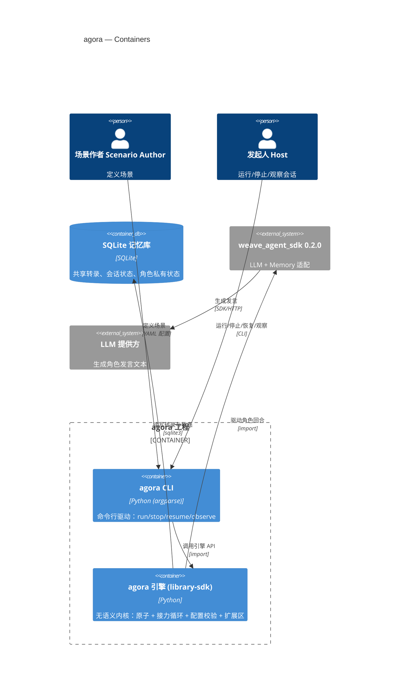

## 6. Runtime view

**Critical flow 1: 接力一轮（happy path）**

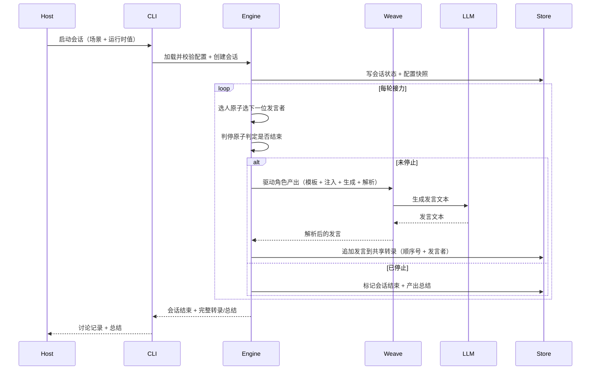

**Critical flow 2: 启动会话的配置校验（error path，AC-03/04/13）**

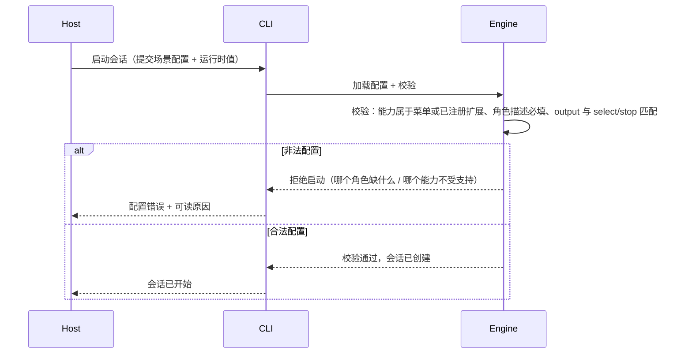

### Flow 3 · 启动会话：运行时值校验与会话创建（AC-02 / AC-02b）

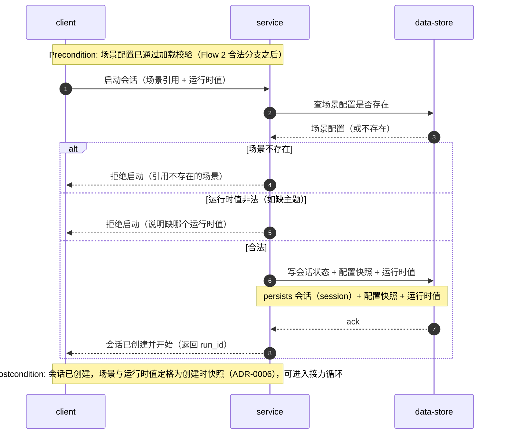

### Flow 4 · 选人路由：选下一位与无效回退（AC-07 / AC-07b）

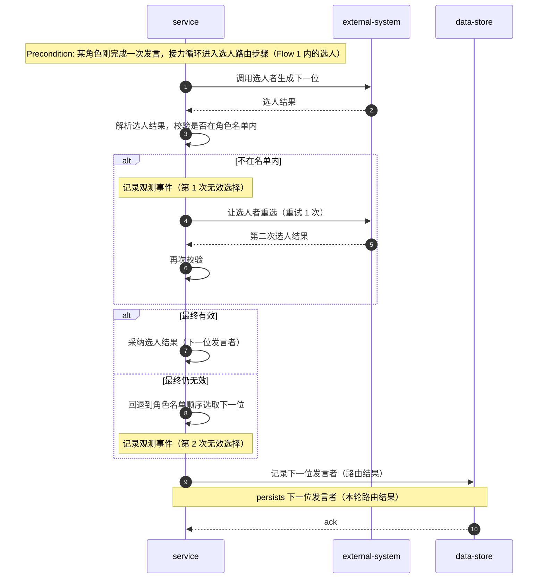

### Flow 5 · 判停与终止：三种路径 + 裁判解析失败回退（AC-08 / AC-09 / AC-10b / OQ4）

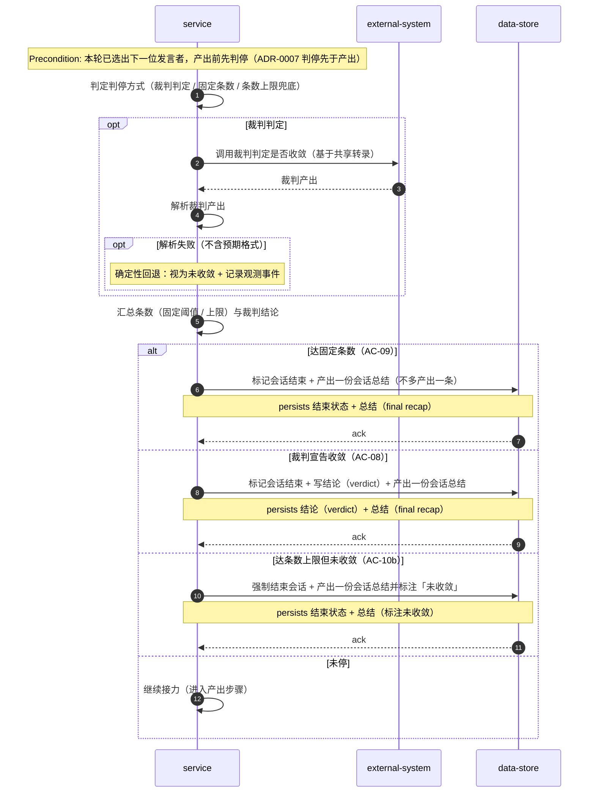

### Flow 6 · 接力不变量：每个 turn 恰好一条发言（AC-06）

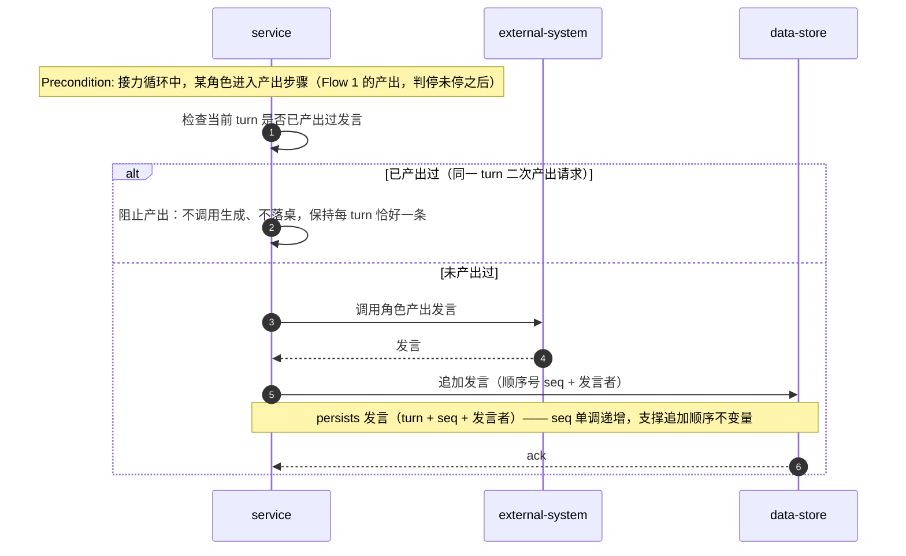

### Flow 7 · 摘要入私有状态：跨轮连续性（AC-12 / US-06）

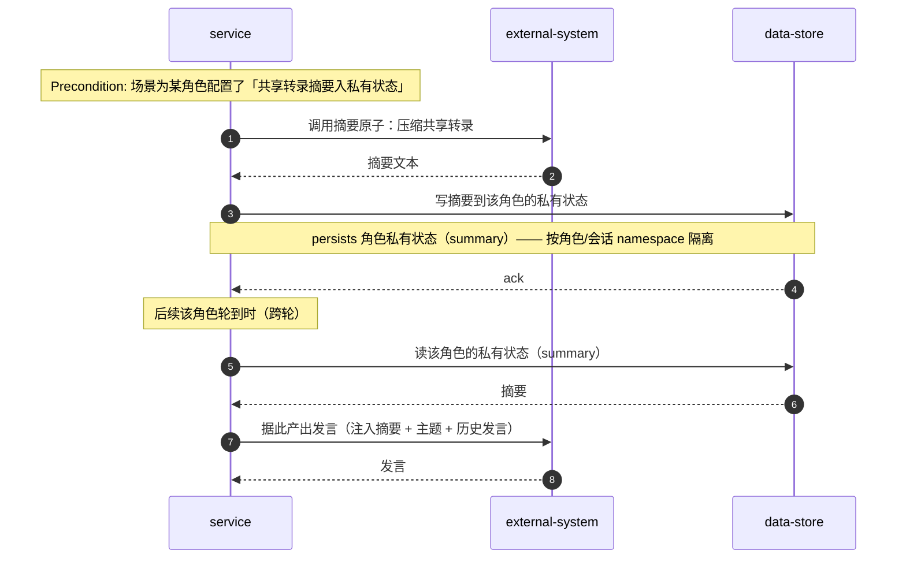

### Flow 8 · 手动停止（AC-11）

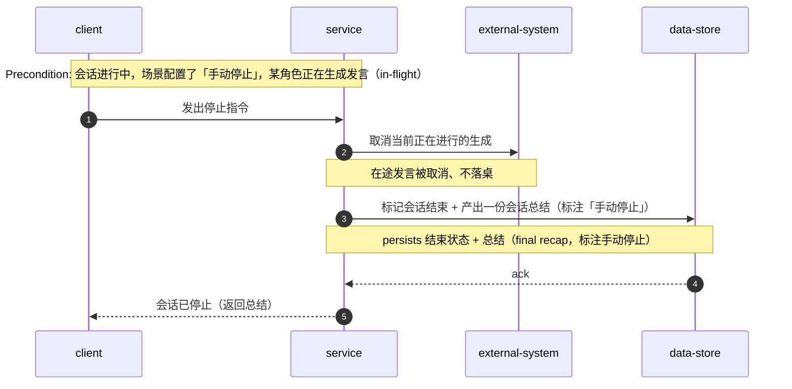

### Flow 9 · 扩展区自定义能力（AC-14 / US-08）

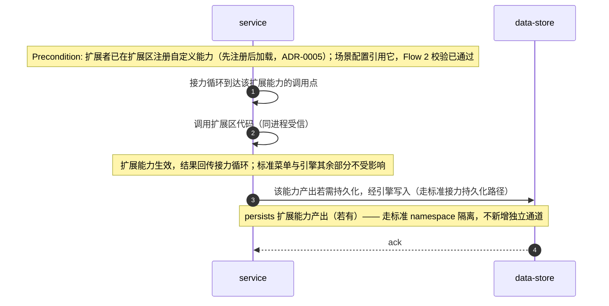

### Flow 10 · 会话恢复（AC-15 / AC-15b）

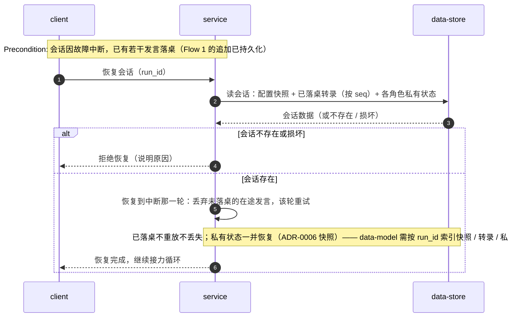

### Flow 11 · 进度事件：命名空间隔离的发布-订阅（AC-18）

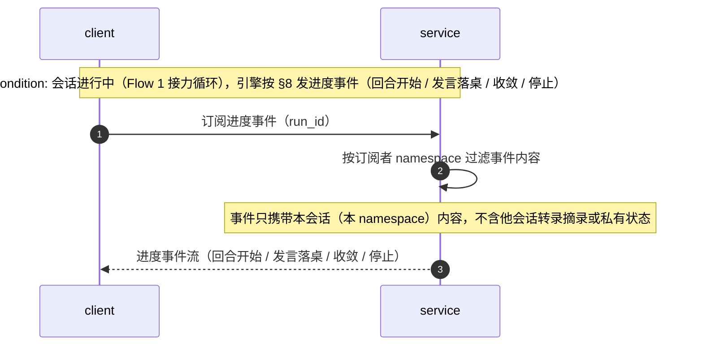

### Flow 12 · 跨会话 / 角色隔离（AC-16 / AC-17）

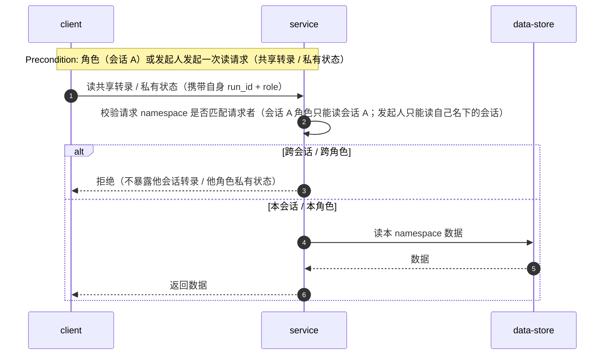

**Flagged items（`sequences` 收尾记录）：**
- **命名差异**：既有 Flow 1/2（`design` 种子图）用具体容器名（Host/CLI/Engine/Weave/LLM/Store），新增 Flow 3–12 按 `sequences` 规范用通用角色名（client/service/data-store/external-system）——两者未强制统一，留给 `design` 对齐（`sequences` 不改既有图）。
- **全部同步流**：本特性为本地单进程 CLI + 库；LLM 为同步请求/响应、进度事件为进程内观察——无 webhook/队列/定时任务，故无幂等键/重试/死信仪式。
- **无新增 ADR 候选**：选人重试 1 次、裁判解析失败回退均已由 §8/OQ 裁决；手动停止、resume 快照均已由 ADR-0006/§4 覆盖。

## 7. Deployment view

本地单进程部署：`agora` CLI 在发起人机器运行，进程内启动引擎；每个会话一个独立 async 任务（沿用 brainstorm ADR-0005 的并发模型），共享一个 SQLite 文件（WAL 模式）。无网络拓扑、无副本——本地命令行工具 + 库，非服务。

**Monitoring:**
- Metrics: `turn_overhead_p95_ms`（每轮编排开销 p95，spec §6 ≤100 ms）、`table_read_p95_ms`（读完整转录 p95，spec §6 ≤50 ms）、`session_token_usage`（每会话 token，spec §7 KPI）。
- Alerts: 会话停滞（单轮无进展超阈值）→ 记录并提示发起人。
- Tracing: 会话/回合边界 span（发言落桌、判停判定）。

**Scaling thresholds:**
- 单进程舒适承载 ≥5 并发会话（spec §6 并发会话数 ≥5、隔离 AC-16/17）。
- 会话数达数十量级时评估进程池/多进程；SQLite 单文件 WAL 为单写者，极端并发写另议（§11）。

## 8. Crosscutting concepts

| Concept | Convention | Where defined |
|---|---|---|
| Logging | 结构化日志，字段 `module=<name>`、`run_id` | 此处（§8） |
| Error handling | 单一 `DomainError`（snake_case 中性错误码 `agora.*`，取代 brainstorm 的 `session.*`）+ 中文可读 message + details；领域哨兵 → adapter 映射 → CLI 退出码/提示 | 此处（§8） |
| Authorization / Isolation | 会话/角色按 namespace 隔离（`agora:{run_id}:*` 共享 + 角色私有），跨会话/角色读写被拒（AC-16/17） | ADR-0006；spec §6.1 |
| ID strategy | `run_id`（UUID）；发言按追加顺序号 `seq`（应用层单调递增） | 此处（§8） |
| Internationalisation | N/A，单语言（zh） | — |
| Observability | 进度事件 + 会话/回合边界 span | 此处（§8）+ §7 |
| Events | 进度事件（回合开始/发言落桌/收敛/停止），不承载控制流（沿用 brainstorm ADR-0004 语义） | 此处（§8） |
| 配置校验 | 加载时校验（菜单 ∪ 已注册扩展，未注册即拒） | ADR-0005 |
| 裁判解析失败回退 | 裁判产出解析失败（不含预期格式）→ 确定性回退（视为不收敛）+ 记录观测事件 | 此处（§8，spec §8 OQ4） |
| 选人无效重试 | 选人者选定的下一位不在名单内 → 重试 1 次，仍无效回退到名单顺序选取 + 记录观测事件 | 此处（§8，spec §8 OQ6） |

## 9. Architecture decisions

| # | Title | Status | Section |
|---|---|---|---|
| 0001 | Build agora as a library-sdk driven by a CLI | Accepted | §4 |
| 0002 | Extract the kernel into a new semantics-free `agora/` package | Accepted | §4 |
| 0003 | Replace the four extension protocols with a five-atom closed menu + declarative config | Accepted | §4 |
| 0004 | Provide a controlled extension zone (same-process trusted, unversioned) | Accepted | §4 |
| 0005 | Validate config at load time against the closed menu ∪ registered extensions | Accepted | §4 |
| 0006 | Resume sessions from a creation-time config snapshot | Accepted | §4 |
| 0007 | Check stop before producing each turn | Accepted | §4 |

ADR files live under `docs/features/agora/adr/NNNN-<title>.md`.

## 10. Quality requirements

**QG-1. 配置加载正确性**
- **When:** 场景作者提交非法配置（引用不存在的选人/判停方式、角色缺描述、裁判产出格式与判停不符）。
- **Then:** 非法配置 100% 在加载时被拒绝并给出可读原因（哪个角色缺什么 / 哪个能力不受支持）。
- **How verify:** 覆盖全部已知非法类别的校验测试（spec §6 配置加载正确性行）。

**QG-2. 一致性 / 耐久**
- **When:** 会话进行中，多角色多次追加发言。
- **Then:** 共享转录完整、有序、标注发言者；每场会话 0 条丢失或重复发言。
- **How verify:** 追加顺序不变量测试（spec §6 一致性/耐久行）。

**QG-3. 会话可靠性**
- **When:** 会话进行中遇到进程崩溃 / 生成失败 / 超时 / 断连。
- **Then:** 按月窗口，已开始的会话 ≥99.9% 不被意外中断（仅计崩溃/生成失败/超时/断连，排除手动停止/封顶/裁判收敛）；恢复到中断那一轮、已落桌不重放。
- **How verify:** 耐久测试（按上述排除项口径统计，spec §6 会话可靠性行）。

**QG-4. 编排 / 读延迟**
- **When:** 单会话运行时测量每轮编排与读完整转录。
- **Then:** 每轮编排开销（不含生成）延迟 p95 ≤100 ms；读取完整共享转录延迟 p95 ≤50 ms。
- **How verify:** 本地插桩（spec §6 两行延迟）。

**QG-5. 并发会话隔离**
- **When:** ≥5 个会话并发运行。
- **Then:** 会话数据隔离（AC-16/17），并发下 p95 延迟不劣化超过 2× 单会话基线（编排 p95 ≤200 ms）。
- **How verify:** 并发冒烟测试（隔离断言 + 并发 p95 对比，spec §6 并发会话数行）。

## 11. Risks and technical debt

| Risk / debt | Severity | Mitigation | Owner |
|---|---|---|---|
| 自选自判（选人者/裁判同时在发言名单 → 自我收敛的作弊转录） | Low | 引擎不加强结构校验（OQ1 裁决）；文档化风险，由场景作者在 prompt 约束 | Tech Lead |
| 主题注入（恶意主题诱导角色泄露系统提示/其它会话内容） | Medium | 主题按不可信数据处理；跨会话 namespace 隔离（AC-16/17）；配置加载校验 | Security Lead |
| 摘要失真（摘要丢弃关键信息致裁判误判收敛） | Medium | 摘要原子可观测；收敛判定由裁判基于共享转录（非仅摘要） | Tech Lead |
| 扩展区同进程受信（可触及其它会话数据） | Medium | 读范围以 AC-16/17 为界；信任建立在扩展者可信上（OQ7 裁决） | Security Lead |
| 生成失败语义未定（重试/跳过策略） | Medium | 在途取消由 AC-11、在途丢弃+该轮重试由 AC-15 已定；生成超时/空结果的重试/跳过留给 `sequences`/`implement` | Tech Lead |
| SQLite 单文件 WAL 单写者，极端并发写有上限 | Low | ≥5 会话舒适；数十量级再评估进程池（§7） | Backend |
| 破坏性重构风险（brainstorm 迁移） | Medium | brainstorm 测试回归实证（AC-01）；旧数据不迁移（spec §3） | Tech Lead |
| Effort budget / deadline 未定（spec 未引） | Medium | 补齐 PM 预算与截止日期 | PM |

**Accepted debt (acceptable in v1, plan to fix later):**
- 扩展区 ABI 本轮不承诺稳定/版本化（OQ5 裁决）——未来需要时再版本化。
- 进度事件无 schema 版本化（仅观测，未来消费方多时再版本化）。
- 选人无效重试固定 1 次（OQ6 裁决）——未来可配置化。

> spec §8 的 7 个开放问题已在本设计环节全部裁决：OQ1→§4 内联（自选自判不校验）、OQ2→ADR-0007、OQ3→ADR-0006、OQ4→§8（确定性回退+事件）、OQ5→ADR-0004、OQ6→§8（重试 1 次）、OQ7→ADR-0004（同进程受信）。

## 12. Glossary

| Term | Meaning |
|---|---|
| 场景作者（Scenario Author） | 用声明式配置定义一个场景的人；只写配置、不写引擎代码（除非经扩展区） |
| 发起人（Host） | 提供运行时值并启动/停止/观察会话的人或系统，本身不发言 |
| 角色（Role / 参与者） | 场景里定义、会在共享转录发言的 AI 角色 |
| 选人者（Selector role） | 决定下一位发言者的角色 |
| 裁判（Judge role） | 判定是否收敛的角色 |
| 扩展者（Extension Author） | 经扩展区写自定义能力代码的人 |
| 观察者（Observer） | 订阅进度事件、只读不发言的角色 |
| 引擎（Engine / agora） | 无语义的接力协作内核：按序接力 + 共享转录 + 判停 + 持久化恢复 |
| 原子（Atom） | 引擎收敛的最小能力单元：产出 / 选人 / 判停 / 存储 / 摘要 |
| 场景（Scenario） | 引擎上的一类应用 = 声明式配置 + 运行时值 |
| 菜单 / 闭集（Closed menu） | 标准原子的固定集合；场景作者从菜单里组合 |
| 扩展区（Extension zone） | 受控的自定义代码接入点，独立于标准菜单、不承诺稳定 ABI（本轮） |
| 共享转录（Shared transcript） | 全员可见、按序累积、标注发言者的发言记录 |
| 私有状态（Private state） | 角色跨轮携带的私有笔记/草稿，他人不可见；可由摘要填充 |
| 结论（Verdict） | 裁判判停路径产出的收敛判断；仅裁判收敛路径产出 |
| 总结（Final recap） | 任意终止路径都产出的全局复盘：汇总私有状态 + 共享转录 |
| 中性命名空间（Neutral namespace） | `agora:{run_id}:*`（共享）+ 角色私有，取代 brainstorm 的 `brainstorm:`/`persona:` 硬编码根 |
