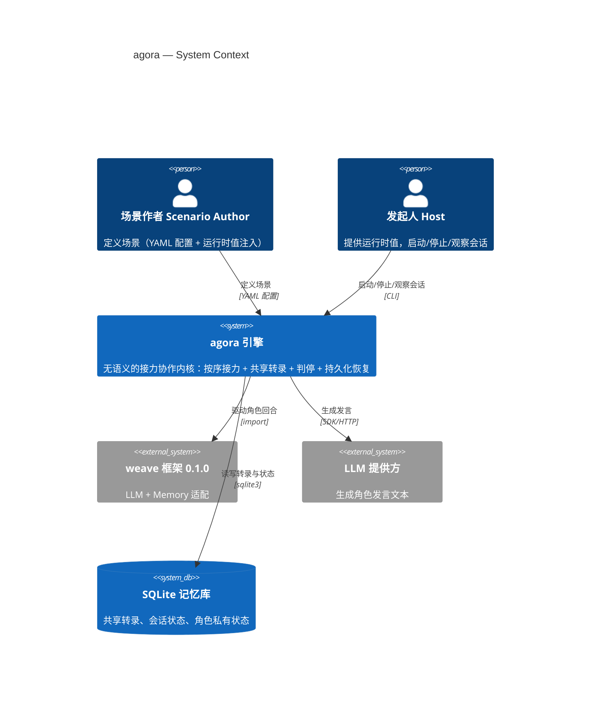
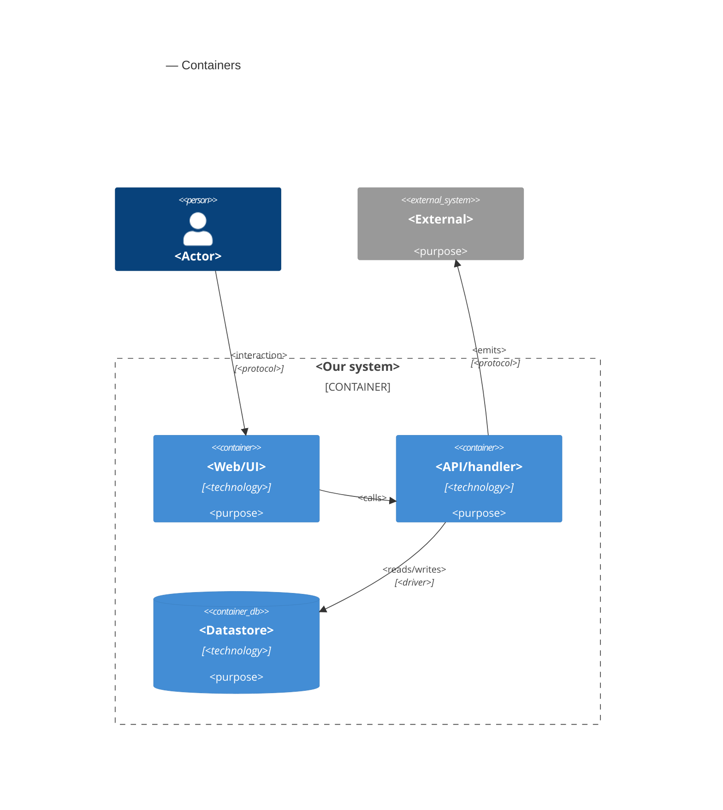

# Software Architecture Document — agora

<!-- 12 Arc42 sections. Empty section → <!-- N/A: <one-line reason> -->. -->
<!-- C4 Context (L1) lives inline in §3. C4 Container (L2) lives inline in §5. -->
<!-- Numbers in §10 come VERBATIM from spec.md §6 NFR — no inventing, no rounding. -->

## 1. Introduction and goals

**Intent.** agora 是「多方接力协作引擎」的**引擎层泛化**：把 brainstorm 里已被证明可行的「多角色按序接力 + 共享转录 + 判停 + 持久化恢复 + 扩展点」内核，从 brainstorm 语义中剥离，做成**无语义**的接力协作内核。目标用户是**场景作者**——想在引擎上搭「头脑风暴 / 辩论 / 面试」这类场景的人，他们要的是「填一份配置就能跑一个新场景」，而不是「再写一个引擎」。

**Top-3 quality goals（一行一句；完整场景在 §10）**

1. **配置加载正确性** — 非法配置 100% 在加载时被拒绝并给出可读原因（零代码扩展的前提，也是配置成为「准代码」后的第一道注入面闸门）。
2. **一致性 / 耐久** — 每场会话 0 条丢失或重复发言（追加顺序不变量）。
3. **会话可靠性** — 已开始的会话 ≥99.9% 不被意外中断，可恢复到中断那一轮、已落桌不重放。

**Stakeholders（角色取自 CONTEXT 术语表，不杜撰）**

| Role | Interest | Sign-off owner? |
|---|---|---|
| 场景作者（Scenario Author） | 用配置定义场景，零引擎代码 | No |
| 发起人（Host） | 提供运行时值，启动/停止/观察会话 | No |
| 角色（Role / 参与者） | 按序在共享转录发言 | No |
| 选人者（Selector role） | 决定下一位发言者 | No |
| 裁判（Judge role） | 判定是否收敛 | No |
| 扩展者（Extension Author） | 经扩展区接入自定义能力 | No |
| 观察者（Observer） | 订阅进度事件（只读） | No |
| Tech Lead | SAD 审批 | Yes |
| Security Lead | 安全审查（配置注入面 + 扩展区信任边界） | No |

<!-- Decision overrides (¶4) — populated by the critic resolution loop, empty otherwise. -->

## 2. Constraints

**Technical.**
- Python ≥3.11（weave `requires-python = ">=3.11"`；ruff/mypy target py311）。
- weave **0.1.0**（外部依赖：LLM + Memory；本轮在 `pyproject.toml` 正式声明并固定版本）。PyYAML ≥6.0（唯一显式运行时依赖，配置解析）。
- SQLite（经 weave `memory_entries` 单表，`namespace + access_type + key` 三键隔离；无 ORM）。
- asyncio（标准库，会话并发）+ argparse（标准库，CLI）；无 pydantic/click/typer。
- LLM 经 weave `BaseLLM` 适配（deepseek / anthropic / openai 可插拔；离线 `FakeLLM`）。
- 架构约定：单向依赖分层——领域层零 weave 依赖、适配层是唯一集成点、配置全部来自 YAML、零硬编码。

**Organisational.**
- Effort budget — `<TBD by PM>`（spec 未引，§11 记待定）。
- Deadline — `<TBD by PM>`。
- Team — 单人（Asher）。

**Conventions.**
- 依赖方向单向（`tests/test_domain.py` 断言 business 不 import weave）。
- 命名：agora 需中性化 brainstorm 的领域词汇（Session/Speech/Persona → 中性 turn/agent/run 概念）。
- 隔离：namespace 按会话隔离，根前缀中性化（`agora:{session_id}:*`，取代硬编码的 `brainstorm:`/`persona:`）。
- 错误码中性化（去掉 `session.*` 的 brainstorm 前缀语义）。

**Regulatory / external.**
- Data classification: **internal**（spec §6.1 —— 讨论记录含未定稿推理）。
- Personal data: **无**（角色均为虚构）。
- Security review: **Required**（配置成为「准代码」后的注入面 + 扩展区代码的信任边界）。

## 3. Context and scope

agora 引擎让**场景作者（Scenario Author）**用一份声明式 YAML 配置定义场景（角色 + 选人 + 判停 + 产出），**发起人（Host）**提供运行时值启动会话，多个 AI **角色**按序接力发言到一张全员可见的**共享转录**；**选人者**决定下一位发言者、**裁判**判定是否收敛、判停方式结束会话，会话可持久化并在崩溃后恢复。系统本地运行、由 CLI 驱动，无语义——不「懂」头脑风暴或辩论，只做接力协作的机制。

<!-- brownfield: 复用 brainstorm 工程（单包 brainstorm/，三层单向依赖 + weave 适配层 + SQLite namespace 隔离），内核抽成中性 agora/ 包 -->

**External systems (in / out):**

| Actor or system | Type | Interaction |
|---|---|---|
| 场景作者（Scenario Author） | Person | 定义场景（YAML 配置 + 运行时值注入），零引擎代码 |
| 发起人（Host） | Person | 提供运行时值，启动/停止/观察会话，订阅进度事件 |
| weave 框架 0.1.0 | System (external) | LLM + Memory 适配（BaseLLM / MemoryManager），唯一集成点 |
| LLM 提供方 | System (external) | 生成角色发言文本（deepseek / anthropic / openai） |
| SQLite 记忆库 | System (external datastore) | 持久化共享转录、会话状态、角色私有状态 |

**信任边界**：主题与运行时值按不可信数据处理（spec §6.1 主题注入）；场景配置按「准代码」处理——加载时校验、非法即拒；LLM 输出按不可信数据处理；跨会话/跨命名空间读写被隔离拒绝（AC-16/17）。

**C4 Context (L1):**



## 4. Solution strategy

**目标表面（Target surfaces）**：`library-sdk`（引擎内核，公开 Python API 即契约）+ `cli`（命令行驱动器）——见 frontmatter `target_surfaces` 与 ADR-0001。本迭代无 UI 表面（spec §3 非目标「不做 Web 前端/论坛界面」，观察者角色留 roadmap 步骤 5）。

**Top strategic choices（ADR 的种子）**

1. **原子 + 声明式配置取代四扩展协议**（ADR-0003）— 内核收敛为闭集菜单的五个原子：**产出**（模板 + 注入 + LLM + 解析）、**选人**（round_robin / llm_pick）、**判停**（fixed_rounds / llm_verdict / manual）、**存储**（StreamStore + StateStore 的 namespace KV）、**摘要**（共享转录压缩进角色私有状态）。能力集合相同的场景 = 一份 YAML 配置，零引擎代码。brainstorm 的四扩展协议（Role/Scheduler/StopCondition/Consumer）从「Python 协议 + 各自实现」降维为「配置 + 少量选择器/终止器原子」。
2. **扩展区作为受控逃生门**（ADR-0004）— 菜单之外的自定义能力走扩展区，独立于标准菜单、接口风格可自定义；本轮不承诺稳定/版本化；信任边界 = 同进程、视为受信代码、读范围以 AC-16/17 为界。
3. **配置校验一等能力**（ADR-0005）— 非法配置加载时 100% 拒绝 + 可读原因；「已知能力」= 闭集菜单 ∪ 已注册扩展能力（扩展先注册、后加载，未注册即拒）。
4. **新建中性 `agora/` 包**（ADR-0002）— 内核与场景解耦：新建无语义 `agora/`（类型/命名空间/错误码全部中性化），brainstorm 迁移为它的第一个场景配置（实证零代码扩展）。
5. **单一 SQLite + 中性命名空间 + 恢复快照**（ADR-0006）— 单一 SQLite 库、`agora:{session_id}:*` 中性命名空间、resume 按创建时快照配置（避免半程改配置）。
6. **判停先于产出的接力循环**（ADR-0007）— 每轮循环：选人 → 判停 →（未停才）产出 → 落桌，避免「收敛前多一条发言」（对齐 AC-09/AC-10b）。

**引擎无语义边界**（内联，非 ADR）— 引擎只强制「业务无关」机制（防失控空转的条数上限、每 turn 恰好一条、跨会话隔离）；「业务可被 prompt 解决」的行为（如防止选人者反复点中同一角色、自选自判）留给场景作者在 prompt 约束，不写成引擎结构校验（spec §8 OQ1 裁决，§11 记录为已接受风险）。

每个战术决策应追溯到这些种子之一；与种子矛盾的战术决策是红旗，在 §11 揭示。

## 5. Building block view

<!-- 🎯 Why: INTERNAL DECOMPOSITION — modules, containers, datastores. The static topology: who
     may talk to whom. Without §5, §6 (the flows) has no vocabulary of participants.
     📋 Write: 1 ¶ on the style (layered / hexagonal / clean / event-driven) + a folder tree + a
     C4Container block.
     📌 Draw ONE Container per declared `target_surface` (frontmatter): a fullstack
     [backend-service, web-frontend] = a backend-API container + a web/SPA container; a
     [backend-service, mobile-app] = the API + the mobile app. The Container(web, …) line below is
     just one surface's container — swap/add per what was declared in §4. → _shared/surfaces.md
     📌 e.g. «web app, content API, media worker, datastore, object store, CDN». -->

<One paragraph: layered / hexagonal / clean / event-driven, and why.>

**Internal decomposition:**

```
<e.g. modules/<feature>/>
├── domain/       <entities + sentinel errors>
├── app/          <use cases / services>
├── infra/        <repository + integration impl>
├── ports/        <handlers, DTOs, error mapping>
└── wiring        <self-wiring entry point>
```

**C4 Container (L2):** <!-- syntax → references/c4-mermaid-syntax.md. Real names, no <placeholder> stubs. ONE Container per declared target_surface (frontmatter); the web container below is one example surface. -->



## 6. Runtime view

<!-- 🎯 Why: the RUNTIME FLOW of 1–2 critical scenarios — who talks to whom, when, in what order.
     Without §6, §5 is just boxes with no life.
     📋 Write: a Mermaid sequenceDiagram. Participants are names from §5 (don't invent new ones).
     Messages are semantic («saves a draft»), NO HTTP verbs / paths / status codes — endpoint-level
     sequences arrive at the `api` stage.
     📌 e.g. «author → web: composes draft → web → content API: save». Seed the primary flow(s) here;
     the `sequences` stage then covers every §5 AC (no cap). Never N/A for M+; XS/S keeps ≥1 happy-path flow. -->

**Critical flow 1: <flow name>**

```mermaid
sequenceDiagram
    actor Actor
    participant Web
    participant Service
    participant Store
    Actor->>Web: <action>
    Web->>Service: <call>
    Service->>Store: <write>
    Store-->>Service: ok
    Service-->>Web: result
    Web-->>Actor: confirmation
```

**Critical flow 2: <e.g. async event propagation>** — <if applicable, otherwise N/A>.

## 7. Deployment view

<!-- 🎯 Why: the TOPOLOGY DevOps must know without reading the deploy charts — how many replicas,
     where the background worker lives, AT WHAT NUMBERS we scale.
     📋 Write: 2–3 sentences on topology + monitoring + concrete threshold numbers.
     📌 e.g. «500 authors → partition by quarter» (not «we'll think about scale later»).
     🎯 N/A allowed for XS/S that reuses an existing deployment unit with no change.
     Deployment-diagram scaffold → templates/deployment.md. -->

<Topology in 2–3 sentences. Where it runs, replicas, scaling thresholds.>

**Monitoring:**
- <Metrics — e.g. `<metric_name>`>
- <Alerts — e.g. «worker lag > 10 min → page on-call»>
- <Tracing — e.g. spans on the request boundary>

**Scaling thresholds:**
- <e.g. comfortable in one table up to N rows/year>
- <e.g. partition by quarter above N rows/year>

<!-- For XS/S with no deployment change: <!-- N/A: reuses existing deployment unit, no infra change --> -->

## 8. Crosscutting concepts

<!-- 🎯 Why: CROSS-CUTTING PATTERNS spanning several modules: logging, errors, authorization, ID
     strategy, events, caching. ⭐ The second-densest section. A pattern inside one module is NOT
     here; a project-wide convention belongs in the convention file.
     📋 Write: a table — concept / convention / where defined. One row per concept.
     📌 e.g. «sortable time-based IDs generated in the app layer» as a default from the convention file. -->

| Concept | Convention | Where defined |
|---|---|---|
| Logging | <e.g. structured, fields `module=<name>`> | <convention file §X or here> |
| Authentication | <e.g. token-based via middleware> | <convention file §X> |
| Error handling | <e.g. domain sentinel → ports error mapping → JSON> | <convention file §X> |
| ID strategy | <e.g. sortable time-based ID in the app layer> | <convention file §X> |
| Internationalisation | <e.g. N/A, single language> | — |
| Observability | <e.g. tracing on the request boundary> | — |
| Events | <module-specific patterns, if any> | <here> |

## 9. Architecture decisions

<!-- 🎯 Why: the REVERSE INDEX onto the adr/ folder. `ls adr/` gives the files; §9 gives the
     semantics — why they exist, which SAD section they attach to, what status.
     📋 Write: a 4-column table, one row per ADR. Mixed status is fine.
     📌 e.g. «0001 | Store content as a table of typed blocks | Accepted | §4». -->

| # | Title | Status | Section |
|---|---|---|---|
| <NNNN> | <imperative — e.g. "Use a sliding-window counter for rate limiting"> | Accepted | §<N> |
| <NNNN> | <imperative — e.g. "Co-locate the worker in the API process"> | Accepted | §<N> |

ADR files live under `docs/features/<slug>/adr/NNNN-<title>.md`.

## 10. Quality requirements

<!-- 🎯 Why: the QUALITY TREE — take a goal from §1 and break it into concrete leaves: tests,
     metrics, configs, drills. ⭐ Without §10, §1 is a manifesto. With §10 each declaration maps
     to something PROVABLE.
     📋 Write: per §1 goal — When / Then / How-verify. Numbers from spec §6 NFR VERBATIM (don't
     round ≤250ms to ≤300ms — that's a critic F6 hit).
     📌 e.g. «p95 ≤ 500 ms on a block update, verified by a 100 req/s load test». -->

Each top-3 goal from §1 expanded into a full scenario:

**QG-1. <quality attribute>**
- **When:** <trigger condition>
- **Then:** <expected behaviour with numbers from spec §6 NFR>
- **How verify:** <test / chaos drill / load test / metric>

**QG-2. <quality attribute>**
- **When:** <trigger>
- **Then:** <expected>
- **How verify:** <how>

**QG-3. <quality attribute>**
- **When:** <trigger>
- **Then:** <expected>
- **How verify:** <how>

## 11. Risks and technical debt

<!-- 🎯 Why: ⭐ collects EVERYTHING that can break — not only the technical. Without §11 risks get
     discussed at standups and lost; debt lives only in the head of whoever accepted it.
     📋 Write: a risk/debt table — severity — mitigation — owner. Accepted debt in its own block.
     📌 The first risk is often a product risk, not a technical one. That's normal. -->

<!-- Severity literals: Low / Medium / High for regular risks; "Open question" for rows created by
     a Save-as-OQ resolution during the Socratic walk (see references/socratic.md). -->

| Risk / debt | Severity | Mitigation | Owner |
|---|---|---|---|
| <e.g. Worker lag may reach hours during a downstream outage> | Medium | <alert >10 min, on-call playbook, retry backoff> | <DevOps> |
| <e.g. No event-schema versioning in v1> | Medium | <ADR-NNNN planned for v2, tolerate unknown fields> | <Backend> |
| Open architectural decision: <decision-headline> | Open question | Resolve before <stage trigger or YYYY-MM-DD>; <inline rationale from the Save-as-OQ> | <owner> |

**Accepted debt (acceptable in v1, plan to fix later):**
- <e.g. the entity is immutable / unversioned — OK for v1, may need audit versioning in v2>

## 12. Glossary

<!-- 🎯 Why: ⭐ the DOMAIN GLOSSARY that ends arguments a year later («checkpoint — weekly or
     biweekly? quarter — calendar or fiscal?»).
     📋 Write: a term / meaning table. Business + technical terms mixed.
     📌 e.g. «Lesson | a unit inside a course made of blocks (text, video)». -->

| Term | Meaning |
|---|---|
| <e.g. domain object A> | <its meaning in this domain> |
| <e.g. domain object B> | <its meaning> |
| <e.g. domain invariant name> | <the rule, in plain language> |
