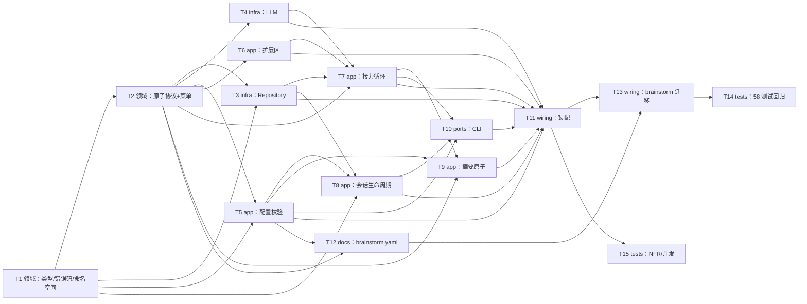

# Epic — agora

> **Spec:** [spec.md](../spec.md) · **Design:** [sad.md](../sad.md) · **Data model:** [data-model.md](../data-model.md) · **API:** [public-api.md](../contracts/public-api.md) · [cli.md](../contracts/cli.md) · **ADRs:** [adr/](../adr/)

## Goal

把 brainstorm 已被证明可行的「多角色按序接力 + 共享转录 + 判停 + 持久化恢复」内核抽成**无语义**的 `agora/` 包（[ADR-0002](../adr/0002-extract-semantics-free-agora-package.md)），交付形态为 `library-sdk` + `cli` 两个表面（[ADR-0001](../adr/0001-build-agora-as-library-sdk-and-cli.md)）：场景作者用一份 YAML 配置组合闭集菜单的五个原子（[ADR-0003](../adr/0003-replace-extension-protocols-with-five-atom-menu.md)），非法配置加载时被拒（[ADR-0005](../adr/0005-validate-config-at-load-time.md)），会话按创建时快照可恢复（[ADR-0006](../adr/0006-resume-from-creation-time-config-snapshot.md)），接力循环判停先于产出（[ADR-0007](../adr/0007-check-stop-before-producing-each-turn.md)）。最终以 brainstorm 迁移为纯配置场景 + 58 测试回归实证「零代码扩展」（AC-01）。

## Scope

- **In:** 新建 `agora/` 中性包（domain 类型/原子/命名空间/错误码 → infra 适配（SQLite repository + LLM）→ app 配置校验/扩展区/接力循环/会话生命周期/摘要 → ports CLI → wiring 装配）；`scenarios/brainstorm.yaml` 第一个纯配置场景；brainstorm 迁移为场景消费方 + 58 测试回归；NFR/一致性/并发测试。
- **Out:** 无 UI 表面（`target_surfaces: [library-sdk, cli]`，论坛界面是 roadmap 步骤 3）；无 DB schema change（复用 weave `memory_entries` 单表，[data-model.md](../data-model.md)「No schema change」→ 无 migration 任务）；观察者角色的进行中产出（spec §3 非目标）；旧 brainstorm 会话数据迁移（spec §3 已允许不迁移）。

## Task map

## Tasks

See [tracker.md](./tracker.md) for status. Machine contract: [tasks.json](../tasks.json).

| # | Task | Layer | Blocked by | DoD (short) |
|---|---|---|---|---|
| T1 | 中性领域类型、错误码、命名空间 | domain | — | 类型/9 错误码/5 命名空间落位，零 weave 依赖 |
| T2 | 五原子协议 + 产出/解析 + 菜单原子 | domain | T1 | 协议 + render/parse + 5 菜单原子，解析单测绿 |
| T3 | SQLite Repository 适配 | infra | T1, T2 | 按 seq 有序读 + 越 namespace 隔离（AC-16/17） |
| T4 | LLM 适配 | infra | T2 | BaseLLM + FakeLLM，离线不触网 |
| T5 | 配置 schema + 加载校验 | app | T1, T2 | 非法配置 100% 拒（AC-03/04/13） |
| T6 | 扩展区注册 | app | T2 | 先注册后加载，未注册即拒（AC-14） |
| T7 | 接力循环 | app | T2, T3, T4, T6 | 选人→判停→产出→落桌 + 事件（AC-05/06/07/07b/08/09/10b/18） |
| T8 | 会话生命周期 | app | T1, T3, T5 | create/resume/stop/read（AC-02/02b/11/15/15b） |
| T9 | 摘要原子 | app | T2, T5, T7 | 摘要入私有状态跨轮（AC-12） |
| T10 | CLI 命令 | ports | T7, T8, T5 | run/stop/resume/observe + 退出码 |
| T11 | 包装配 + DI | wiring | T3–T10 | 公开表面 + pyproject 入口可跑 |
| T12 | brainstorm.yaml | docs | T5, T2 | 纯 YAML 复现 brainstorm 能力集 |
| T13 | brainstorm 迁移 | wiring | T11, T12 | 删引擎、场景化 |
| T14 | brainstorm 58 测试回归 | tests | T13 | 全绿 = AC-01 实证 |
| T15 | NFR/一致性/并发测试 | tests | T11 | 追加不变量 + ≥5 并发隔离 + p95 插桩 |

## Risks / Hard rules

- **上游缺口（api-sync-report §C，未阻塞本 breakdown，落地时需留意）：**
  - **§C-1 `session_id` → `run_id` 命名漂移**：`sad.md` §2/§6/§8 仍残留 `session_id`，而 `data-model.md` + `public-api.md` 已中性化为 `run_id`。本 epic 的任务全部按 **`run_id`** 落笔（data-model 是类型来源）；`sad.md` 回改是 `design` 的 owner。
  - **§C-2 `SummaryConfig` 形状未定义**：`data-model.md` 的 `config.scenario.summary` 仅 `{...}|null`，无字段级定义。T9 采用**最小形状**（`role`/`key`/`window`）并标记「待 data-model ratify」，不发明超出该范围的字段。
- **Hard rules（spec §6 / sad §11，任务不得违背）：**
  - 领域/内核层**零 weave 依赖**（`tests/test_domain.py` 断言 business 不 import weave）——T1/T2 不得 import weave。
  - 依赖方向单向：`adapter/` 是唯一 weave 集成点（T3/T4）；配置全部来自 YAML，零硬编码。
  - 引擎只强制「业务无关」机制（条数上限、每 turn 恰好一条、跨会话隔离）；「自选自判」「选人反复点中同一角色」等业务行为**不写成引擎结构校验**（sad §4 内联，spec §8 OQ1）——T7 不得加此类校验。
  - 判停先于产出（ADR-0007）：T7 每轮顺序 `选人 → 判停 →（未停才）产出 → 落桌`，绝不额外多产一条（AC-09/AC-10b）。
  - 裁判解析失败 → 确定性回退（视为未收敛）+ 观测事件；选人无效 → 重试 1 次，仍无效回退名单顺序 + 观测事件（sad §8）。
  - 进度事件**不持久化**（进程内发布-订阅，AC-18），与落盘的观测事件（`agora:{run_id}:events:stream`）区分（data-model §System records）。
