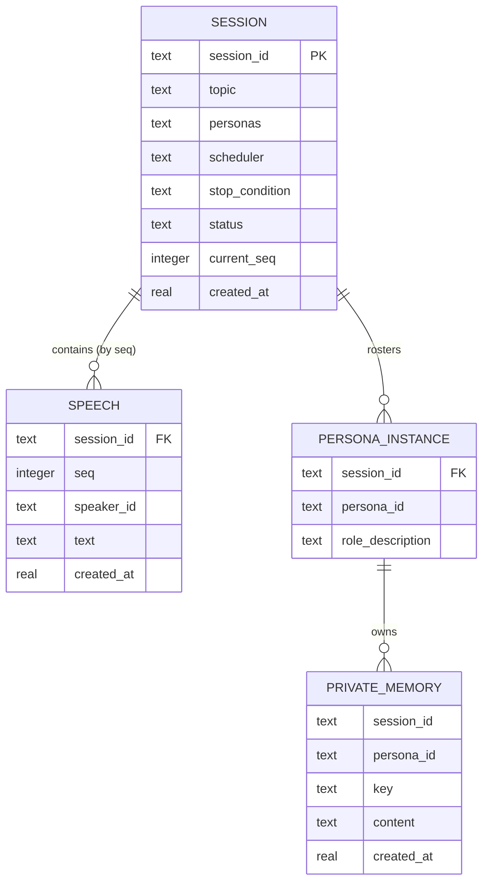

# Data model — brainstorm

> **No schema change.** 本特性的持久化复用 weave 现成的 `memory_entries` 表（ADR-0003/0005/0006），不新建表、列、索引，也不写迁移。本文件记录的是**逻辑数据模型**——Session / Speech / 人设私有记忆这些领域实体如何映射到这一张通用的 KV 表（经 `namespace` + `access_type` + `key` 区分）。零迁移是合法结果，不是缺失（→ size-matrix `data-model` fast lane「no schema change」）。

## Physical table（复用，非本特性新建）

`memory_entries` 由 weave SQLite 后端在首次连接时 `CREATE TABLE IF NOT EXISTS` 自建（`weave/memory/backends/sqlite.py`）。本特性**不**迁移它：

| Column | Type | Constraints | Notes |
|---|---|---|---|
| `id` | TEXT | PK, app-generated (uuid4) | 每条记录的唯一 id |
| `namespace` | TEXT | NOT NULL | 隔离维度；本特性用它区分会话/人设/桌面/状态 |
| `access_type` | TEXT | NOT NULL | `stream` \| `state` \| `knowledge`；本特性只用前两者 |
| `key` | TEXT | — | 仅 `state` 用；stream 为 NULL |
| `content` | TEXT | NOT NULL | JSON 字符串（领域实体的载体） |
| `metadata` | TEXT | DEFAULT `'{}'` | JSON 字符串；可选标注 |
| `created_at` | REAL | NOT NULL | Unix 时间戳（float） |
| `expires_at` | REAL | — | NULL = 永不过期；TTL 用 |

## ER diagram

<!-- 逻辑模型：实体与所有权关系。物理上这些实体都落在上面那张 memory_entries 表里（见 §Entities 的 Storage 列）。 -->

> 注：`FK` 仅为**逻辑归属**标注——KV 表无参照完整性；隔离由 namespace 字符串约定保证（spec §6.1，ADR-0003）。类型用 SQLite 词汇（`text`/`integer`/`real`），JSON 字段以 TEXT 存 JSON 字符串。

## Entities

### SESSION

**Aggregate root**（根）。一次头脑风暴实例：主题 + 人设名单 + 停止条件 + 共享桌面。

**Storage:** `memory_entries` 行，`access_type='state'`，`namespace = brainstorm:{session_id}:state`。按 `key` 分三个关注点：

| State key | Content (JSON) | Mutable? | Notes |
|---|---|---|---|
| `config` | `{"topic": str, "personas": [{"persona_id": str, "name": str, "role_description": str}], "scheduler": "round_robin"\|"moderator", "stop_condition": {"type": "fixed_rounds"\|"convergence"\|"manual", "max_speeches": int\|null}}` | 否 | 启动时写一次（AC-01）；AC-12 新配置即新 session |
| `status` | `{"status": "running"\|"stopped", "current_seq": int, "last_speaker_id": str\|null}` | 是 | 每轮落桌后更新 `current_seq`；停止时置 `stopped` |
| `conclusion` | `{"converged": bool, "conclusion": str\|null}` | 是 | 停止时写（AC-09 完整记录 / AC-10 结论 / AC-10b 未收敛标注） |

**Logical columns:**

| Field | Type | Storage | Notes |
|---|---|---|---|
| `session_id` | TEXT (UUID) | namespace + `config` | 引擎生成 uuid4，匹配 weave `id` 约定 |
| `topic` | TEXT | `config.topic` | 非空（AC-02 应用层校验） |
| `personas` | JSON array | `config.personas` | 去重后 ≥2（AC-03）；每人设必有 `role_description`（AC-13） |
| `scheduler` | TEXT | `config.scheduler` | `round_robin` / `moderator`（ADR-0002 扩展点） |
| `stop_condition` | JSON | `config.stop_condition` | type + 上限；AC-10b 靠 `max_speeches` 兜底 |
| `status` | TEXT | `status.status` | `running` / `stopped` |
| `current_seq` | INTEGER | `status.current_seq` | 单调递增；下一发言的序号 |
| `created_at` | REAL | `memory_entries.created_at` | 行级时间戳 |

**Constraints:** 无 DDL 约束（KV 表不建 CHECK/FK）。主题非空、人设 ≥2、角色描述必填等不变式在应用层强制（AC-02/03/13）。

### SPEECH

**Storage:** `memory_entries` 行，`access_type='stream'`，`namespace = brainstorm:{session_id}:stream`。共享桌面即该 namespace 下的全部 stream 行，按 `seq` 升序（并列时 `created_at` 兜底）。

**Content (JSON):** `{"seq": int, "speaker_id": str, "text": str}`

| Field | Type | Storage | Notes |
|---|---|---|---|
| `session_id` | TEXT (UUID) | namespace | 作用域 |
| `seq` | INTEGER | `content.seq` | **显式会话内单调序号**（已确认）；「0 丢失/重复、追加顺序」不变量的载体 |
| `speaker_id` | TEXT | `content.speaker_id` | 人设 id（AC-05 标注发言者；系统标注，不以内容自称为准，spec §6.1） |
| `text` | TEXT | `content.text` | 发言正文 |
| `created_at` | REAL | `memory_entries.created_at` | seq 并列时的兜底排序 |

**Aggregate root:** Session。**Access patterns:** 读完整桌面（`WHERE namespace=? AND access_type='stream' ORDER BY created_at`，取回后按 `seq` 排）→ `idx_ns_at`；追加 → `stream_append`。**Constraints:** `seq` 严格单调（应用层保证），单轮内同一发言者不二次追加（AC-15）。

### PERSONA_INSTANCE

同一「人设定义」在某个会话里的实例（spec §8 OQ 默认「每会话独立实例、记忆按会话隔离」）。

**Storage:** 无独立行——物化为 `SESSION.config.personas[]` 的条目。身份 = `(session_id, persona_id)`。其**私有记忆**（PRIVATE_MEMORY）才有自己的行。

| Field | Type | Storage | Notes |
|---|---|---|---|
| `session_id` | TEXT (UUID) | 归属的 session | 会话作用域 |
| `persona_id` | TEXT | `config.personas[].persona_id` | 人设定义 id |
| `role_description` | TEXT | `config.personas[].role_description` | AC-13 必填 |

**Aggregate root:** Session（roster 归属 Session；私有记忆归属本实例）。

### PRIVATE_MEMORY

人设私有、他人不可见的记忆/便签（ADR-0006）。

**Storage:** `memory_entries` 行，`namespace = persona:{session_id}:{persona_id}:stream`（便签，append-only）或 `namespace = persona:{session_id}:{persona_id}:state`（带 `key` 的私有状态，如路由者的收敛草稿）。

| Field | Type | Storage | Notes |
|---|---|---|---|
| `session_id` | TEXT (UUID) | namespace | **会话作用域**（已确认——同一人设定义跨会话隔离，spec §8 默认） |
| `persona_id` | TEXT | namespace | |
| `key` | TEXT | `key`（仅 state） | 私有状态的键 |
| `content` | JSON | `content` | 私有便签/状态内容 |
| `created_at` | REAL | `memory_entries.created_at` | |

**Aggregate root:** PersonaInstance。**Access patterns:** 按 namespace 读 → `idx_ns_at` / `idx_ns_key`。**隔离:** 他人不可见——读路径只带本人设的 namespace（spec §6.1 越界拒绝）。

### System records（跳过 / 无效选择）

AC-04b 的「跳过该参与者及原因」与 AC-07b 的「无效选择」是系统事件，**不是发言**——不应污染共享桌面（AC-05 桌面 = 发言）。**推荐**存为 `stream` 行于独立 namespace `brainstorm:{session_id}:events:stream`（weave 把 namespace 末段当 access_type，落点需以 `:stream` 结尾、不能是字面 `:events`），`content = {"type": "skip"|"invalid_choice", "speaker_id": str, "reason": str}`。append-only、可查询，但不在人设读取桌面的路径上。**（实现已按此落点，见 `business/namespaces.py` `session_events_ns`。）**

## Indexes

复用 weave 已建的三个索引（`sqlite.py:INDEXES_SQL`），**无新增索引**：

| Index | Columns | Query it serves |
|---|---|---|
| `idx_ns_at` | `(namespace, access_type)` | 读完整桌面（`WHERE namespace='brainstorm:{s}:stream' AND access_type='stream' ORDER BY created_at`）；按 namespace 读私有记忆 |
| `idx_ns_key` | `(namespace, access_type, key)` | 读会话状态（`WHERE namespace='brainstorm:{s}:state' AND access_type='state' AND key=?`）；读人设私有 state |
| `idx_ns_expires` | `(namespace, expires_at)` | TTL 清理（若 scope 配置 ttl） |

> `seq` 排序是**应用层**（取回后 `ORDER BY seq`），无 DB 索引——因为 `seq` 在 JSON content 里，无列可索引（「no schema change」的直接后果）。若未来长会话的 `seq` 排序成为热点，加一列 `seq INTEGER` + 索引是逃生门（届时才是 schema change，本特性不做）。

## Test fixtures

测试夹具以工厂函数形式（Python，本仓库测试用；**不进 migrations/**）。PII 护栏：仅 `example.test` / 占位名。

- `make_session(topic="示例主题", personas=..., scheduler="round_robin", stop_condition=...)` — 构造一个 `config` 状态的 JSON。
- `make_persona(name="Test User", role_description="示例角色")` — 构造 roster 条目。
- `make_speech(seq, speaker_id, text)` — 构造一条发言 content JSON（含 `seq`）。
- `make_memory_entry(namespace, access_type, key, content, created_at=...)` — 构造一条 `memory_entries` 行，供 DB 级测试。
