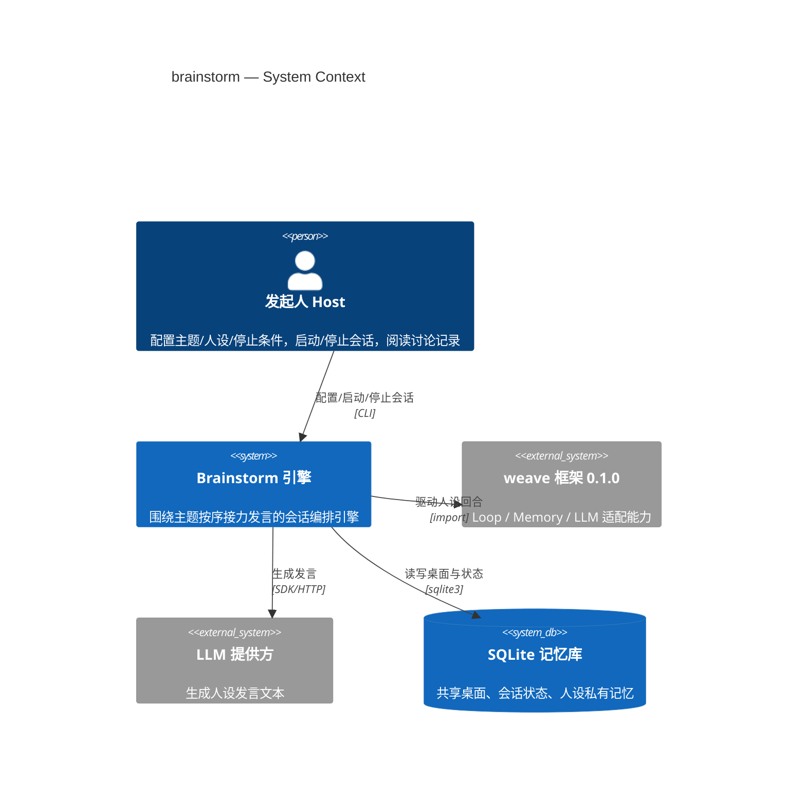
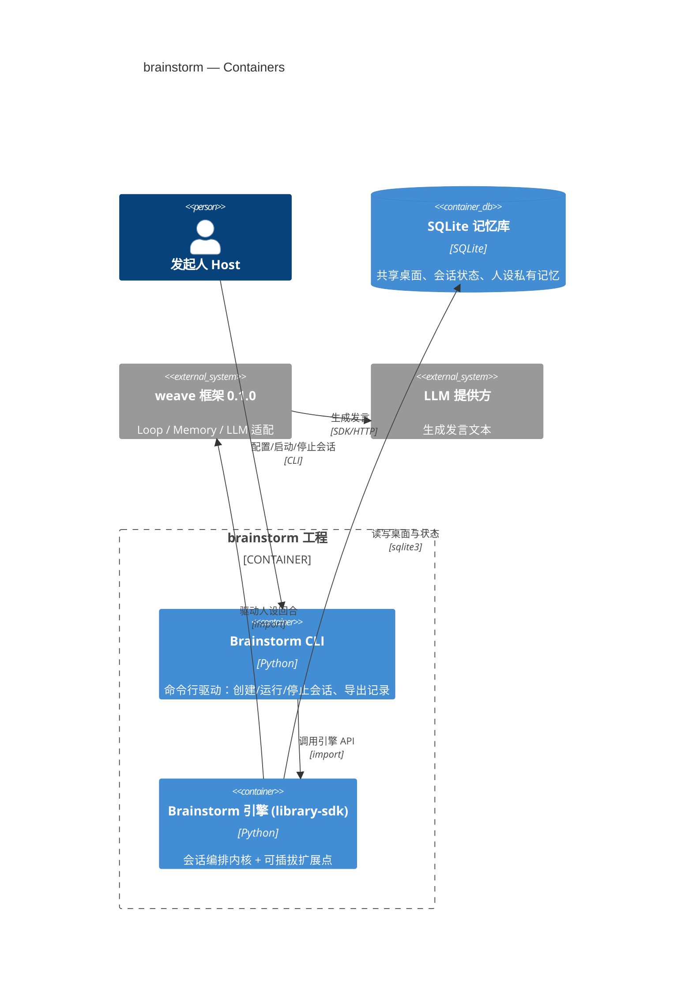
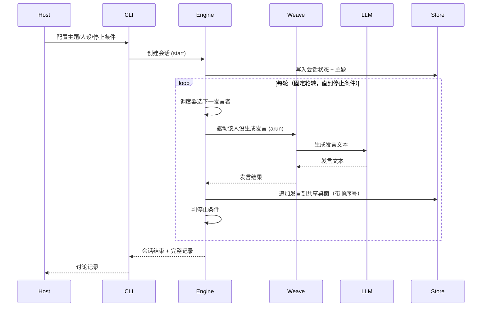

# Software Architecture Document — brainstorm

<!-- 12 Arc42 sections. Empty section → <!-- N/A: <one-line reason> -->. -->
<!-- C4 Context (L1) lives inline in §3. C4 Container (L2) lives inline in §5. -->
<!-- Numbers in §10 come VERBATIM from spec.md §6 NFR — no inventing, no rounding. -->

## 1. Introduction and goals

**Intent.** 把 weave demo「多个人设各自独立回答同一问题、记忆彼此隔离」的演示，升级成「多个人设围绕一个主题、按序接力发言、所有发言共享可见」的头脑风暴机制。目标用户是**发起人（Host）**：在开题、产品决策、技术方案之前，让一组不同视角的 AI 角色围绕一个主题对撞想法，随后阅读讨论记录提炼结论。引擎设计为「稳定内核 + 可插拔扩展点」，先在后端把能力做全、由命令行驱动；角色、调度策略、停止条件、消费界面都是扩展点。

**Top-3 quality goals（一行一句；完整场景在 §10）**

1. **一致性/耐久** — 每场会话 0 条丢失或重复发言（追加顺序不变量）。
2. **会话可靠性** — 已开始的会话 99.9% 不被意外中断，可恢复到中断那一轮。
3. **可扩展性** — 新增一个角色/策略/界面 = 0 处内核改动。

**Stakeholders（角色取自 CONTEXT 术语表，不杜撰）**

| Role | Interest | Sign-off owner? |
|---|---|---|
| 发起人（Host） | 发起、配置、停止会话；阅读讨论记录 | No |
| 参与者（Persona） | 按序在共享桌面发言 | No |
| 路由者（Moderator） | 决定发言顺序与收敛（可选） | No |
| Tech Lead | SAD 审批 | Yes |
| Security Lead | 安全审查（§6.1 多角色生成边界 + 提示词注入面） | No |

<!-- Decision overrides (¶4) — populated by the critic resolution loop, empty otherwise. -->

## 2. Constraints

**Technical.**
- Python 3.11+（weave `requires-python = ">=3.11"`）。
- weave **0.1.0**（外部依赖，来自 `13_weave`，`pip install -e .`；核心仅依赖 PyYAML）。
- SQLite（沿用 demo `memory.db` 单库、`memory_entries` 表、namespace 隔离）。
- LLM 经 weave 的 `BaseLLM` 适配接入（deepseek / anthropic / openai 可插拔；离线用 `FakeLLM`）。
- **代码归属**：本特性在 `14_forum` 新工程实现，weave 为外部依赖（不改 weave 源码）。
- 架构约定：分层沿用 demo —— `business/` 零 weave 依赖、`weave_adapter/` 唯一接入点、配置全部来自 YAML、零硬编码。

**Organisational.**
- Effort budget — `<TBD by PM>`（spec 未引，§11 记一条待定）。
- Deadline — `<TBD by PM>`。
- Team — 单人（Asher）。

**Conventions.**
- 依赖方向单向（demo `README.md:38-58`）：`business/` 不 import weave；`weave_adapter/` 是唯一集成点；作用域名 / world_id / 提示词变量 / 状态键全部读自 YAML，零字面量。
- 命名：`session`（会话）、`speech/utterance`（发言）、`round`（轮）、`shared_table`（共享桌面）。
- 命名空间/隔离：`brainstorm:{session_id}:stream|state` —— 会话级隔离（沿用 weave namespace 机制）。

**Regulatory / external.**
- Data classification: **internal**（spec §6.1 —— 记录含未定稿产品/技术推理）。
- Personal data: **无**（人设均为虚构角色）。
- Security review: **Required**（多角色生成边界 + 提示词注入面）。

## 3. Context and scope

brainstorm 引擎让**发起人（Host）**用一份声明式配置（主题 + 人设名单 + 停止条件）开启一场会话，多个 AI **人设（Persona）**围绕主题按序接力发言，每次发言落到一张所有参与者可见的**共享桌面**，可选的**路由者（Moderator）**决定发言顺序与收敛。系统本地运行、由命令行驱动，未来经扩展点接前端（论坛界面等）。

<!-- brownfield: 复用 13_weave 框架 + demo（weave_adapter 唯一集成点；SQLite namespace 隔离） -->

**External systems (in / out):**

| Actor or system | Type | Interaction |
|---|---|---|
| 发起人（Host） | Person | 配置主题/人设/停止条件，启动/停止会话，阅读讨论记录 |
| weave 框架 0.1.0 | System (external) | 提供 Loop / Memory / LLM 适配能力；唯一接入点 |
| LLM 提供方 | System (external) | 生成人设发言文本（deepseek / anthropic / openai） |
| SQLite 记忆库 | System (external datastore) | 持久化共享桌面、会话状态、人设私有记忆 |

**信任边界**：主题与人设配置按不可信数据对待（spec §6.1 提示词注入面）；LLM 输出按不可信数据对待；跨会话读写被 namespace 隔离拒绝。

**C4 Context (L1):**



## 4. Solution strategy

**目标表面（Target surfaces）**：`library-sdk`（引擎核心，公开 Python API 即契约）+ `cli`（命令行驱动器）——见 frontmatter `target_surfaces` 与 ADR-0001。本迭代无 UI 表面（spec §3 非目标「不实现 Web 前端」）。

**Top strategic choices（ADR 的种子）**

1. **最小内核 + 可插拔扩展点**（ADR-0002）— 内核只含四样：会话生命周期、回合编排循环、共享桌面（append-only、标记发言者）、扩展注册表；角色、调度策略、停止条件、消费界面是四个扩展点，装配时注册默认实现。这是 spec §1「稳定内核 + 可插拔扩展点」的落地。
2. **共享桌面作为单一事实来源** — 每场会话一张 append-only 共享桌面（session 级 namespace `brainstorm:{session_id}:stream`），发言按序追加、标注发言者；人设读完整桌面后生成下一条发言。顺序是「0 丢失/重复」不变量的载体。
3. **同步进程内编排 + 事件仅用于观测**（ADR-0004）— 回合推进（选下一发言者 → 调角色生成 → 追加桌面 → 判停止）走同步调用；weave `event_bus` 只发进度事件，不承载控制流。
4. **单库持久化 + 会话级隔离 + 可恢复**（ADR-0003）— 单一 SQLite 库，会话按 namespace 隔离；发言落盘即追加；崩溃恢复到中断那一轮、已落桌不重放。
5. **每会话独立 weave 实例**（ADR-0005）— 每个会话一个独立 `Weave` 实例（各自 loop/LLM/记忆状态），会话作为独立 async 任务并发；共享 SQLite 文件用 WAL 模式承载并发写。

每个战术决策应追溯到这些种子之一；与种子矛盾的战术决策是红旗，在 §11 揭示。

## 5. Building block view

**分层风格**：六边形/clean —— 沿用 demo 的依赖方向：`business/` 纯领域类型（零 weave 依赖）、`weave_adapter/` 是唯一 weave 集成点、配置全部来自 YAML；内核 `engine/` 只做编排，扩展点 `extensions/` 承载可插拔实现（ADR-0002）。

**Internal decomposition:**

```
brainstorm/                      # 新工程（14_forum）
├── engine/                      # 内核：会话循环 + 共享桌面 + 扩展注册表
├── extensions/                  # 默认扩展实现（可插拔）
│   ├── roles/                   # 人设角色、路由者
│   ├── schedulers/              # 固定轮转、路由者调度
│   ├── stop_conditions/         # 固定轮数、收敛、手动
│   └── consumers/               # CLI 消费、进度观测
├── business/                    # 纯领域类型（零 weave）：Session / Speech / SharedTable / Config
├── weave_adapter/               # 唯一 weave 集成点：PersonaAgent + 作用域配置
└── cli/                         # 命令行入口：commands / flags / exit-codes
```

**C4 Container (L2):**



## 6. Runtime view

**Critical flow 1: 固定轮转接力发言（happy path）**



**错误/失败流（AC-04b 发言失败、AC-11b 在途发言停止等）**：本设计阶段不展开——失败处理另属独立问题域；交由 `sequences` 阶段按 §5 AC 逐条覆盖。

## 7. Deployment view

本地单进程部署：`brainstorm` CLI 在发起人机器运行，进程内启动引擎；每个会话一个独立 async 任务（ADR-0005），共享一个 SQLite 文件（WAL 模式）。无网络拓扑、无副本——本地命令行工具，非服务。

**Monitoring:**
- Metrics: `turn_overhead_p95_ms`（每轮编排开销 p95，spec §6 ≤100 ms）、`table_read_p95_ms`（读桌面 p95，spec §6 ≤50 ms）、`session_token_usage`（每会话 token，spec §7 KPI）。
- Alerts: 会话停滞（单轮无进展超阈值）→ 记录并提示发起人。
- Tracing: 在会话/回合边界打 span（发言落桌、停止判定）。

**Scaling thresholds:**
- 单进程舒适承载 ≥5 并发会话（内存随会话数线性，ADR-0005）。
- 会话数达数十量级时评估进程池/多进程；SQLite 单文件 WAL 为单写者，极端并发写另议（§11）。

## 8. Crosscutting concepts

| Concept | Convention | Where defined |
|---|---|---|
| Logging | 结构化日志，字段 `module=<name>`、`session_id` | 此处（§8） |
| Error handling | 领域哨兵错误 → 适配层错误映射 → CLI 退出码/提示 | 此处（§8） |
| Authorization / Isolation | 会话按 namespace 隔离（`brainstorm:{session_id}:*`）；跨会话读写被拒绝 | ADR-0003；spec §6.1 |
| ID strategy | `session_id`（会话）、发言按追加顺序号 | 此处（§8） |
| Internationalisation | N/A，单语言（zh） | — |
| Observability | event_bus 进度事件 + 会话/回合边界 span | ADR-0004；§7 |
| Events | 进度事件（回合开始/发言落桌/收敛/停止），不承载控制流 | ADR-0004 |
| Context-window injection | 共享桌面注入人设上下文：截断到最近 N 条 + 可选摘要（N 可配置） | 此处（§8，spec §8 OQ 默认） |

## 9. Architecture decisions

| # | Title | Status | Section |
|---|---|---|---|
| 0001 | Build the brainstorm engine as a library-sdk driven by a CLI | Accepted | §4 |
| 0002 | Keep the engine kernel minimal (orchestration loop only) | Accepted | §4 |
| 0003 | Persist sessions in a single SQLite store with resume-at-round | Accepted | §4 |
| 0004 | Orchestrate turns synchronously; use the event bus for observability only | Accepted | §4 |
| 0005 | Give each session its own Weave instance | Accepted | §4 |

ADR files live under `docs/features/brainstorm/adr/NNNN-<title>.md`.

## 10. Quality requirements

Each top-3 goal from §1 expanded into a full scenario:

**QG-1. 一致性/耐久**
- **When:** 会话进行中，多个人设多次追加发言。
- **Then:** 桌面完整、有序地包含每一次发言并标注发言者；每场会话 0 条丢失或重复发言。
- **How verify:** 追加顺序不变量测试（spec §6 一致性/耐久行）。

**QG-2. 会话可靠性**
- **When:** 会话进行中遇到进程崩溃 / LLM 失败 / 超时 / 断连。
- **Then:** 已开始的会话 99.9% 不被意外中断；恢复到中断那一轮、已落桌发言不重放。
- **How verify:** 耐久测试（进程崩溃 / LLM 失败 / 超时 / 断连场景，spec §6）。

**QG-3. 可扩展性**
- **When:** 新增一个角色 / 调度策略 / 停止条件 / 消费界面。
- **Then:** 0 处内核改动（经扩展点接入，ADR-0002）。
- **How verify:** 内核边界由 design 定义后，审查变更范围是否触及内核（spec §6 可扩展性行）。

## 11. Risks and technical debt

| Risk / debt | Severity | Mitigation | Owner |
|---|---|---|---|
| Effort budget / deadline 未定（spec 未引） | Medium | 补齐 PM 预算与截止日期，否则范围易漂移 | PM |
| 失败处理（重试/跳过/在途停止）未在本设计会话展开 | Medium | `sequences` 阶段按 AC-04b / AC-11b 覆盖；本 SAD 不承诺失败语义 | Tech Lead |
| demo「每 persona 隔离」在 stream 层已失效（`world:shared:stream` 累积所有发言） | Medium | 新引擎用 `brainstorm:{session_id}:*` 专用 namespace，不复用 demo 的 world scope | Tech Lead |
| SQLite 单文件 WAL 单写者，极端并发写有上限 | Low | ≥5 会话舒适；数十量级再评估进程池/多进程（§7） | Backend |
| 上下文注入截断 N 为固定配置，无自适应 | Low | v1 接受；未来可加自适应/摘要 | Backend |

**Accepted debt (acceptable in v1, plan to fix later):**
- 失败语义（重试次数、跳过策略、在途发言停止）未定——本设计不覆盖，交 `sequences` / `implement` 后续。
- 进度事件无 schema 版本化（仅观测，未来消费方多时再版本化）。

> Product 自有开放问题（默认人设名单、未来分支优先级）跟踪于 spec §8，不在此重复。

## 12. Glossary

| Term | Meaning |
|---|---|
| 发起人（Host） | 提供主题、选定人设与配置、启动/停止会话的人或系统；本身不发言 |
| 参与者（Persona / 人设） | 具名、带角色描述的 AI 角色，按序在共享桌面发言 |
| 路由者（Moderator） | 可选的参与者型角色，在每次发言后决定下一位发言者并判断收敛 |
| 主题（Topic） | 头脑风暴要讨论的问题或命题 |
| 共享桌面（Shared Table） | 会话内所有发言按序累积、对所有参与者可见的讨论记录（append-only） |
| 发言（Speech / Utterance） | 某参与者对主题与历史发言的一次贡献，落到桌面并标注发言者 |
| 会话（Session） | 一次头脑风暴实例，含主题、人设名单、共享桌面与停止条件 |
| 轮（Round） | 固定轮转模式下所有人设各发言一次；但「固定轮数」停止条件按发言条数计（N 条 = 结束，spec §8 OQ 默认） |
| 停止条件（Stop Condition） | 会话结束的判据（固定轮数 / 收敛判定 / 手动停止） |
| 收敛（Convergence） | 讨论被判定为「已达成结论」的状态 |
| 表面（Surface） | 特性拥有的 C4 容器；本特性为 library-sdk（引擎）+ cli（驱动器） |
| 内核（Kernel） | 会话编排循环 + 共享桌面 + 扩展注册表；最小且稳定（ADR-0002） |
| 扩展点（Extension point） | 可插拔的能力接口：角色 / 调度策略 / 停止条件 / 消费界面（ADR-0002） |
| 调度策略（Scheduling strategy） | 决定下一位发言者的策略（固定轮转 / 路由者） |
| 命名空间（Namespace） | `brainstorm:{session_id}:stream|state` —— 会话级隔离（ADR-0003） |
