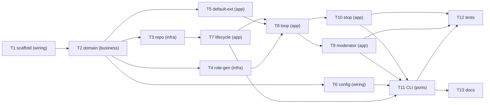

# Epic — brainstorm

> **Spec:** [spec.md](../spec.md) · **Design:** [sad.md](../sad.md) · **Data model:** [data-model.md](../data-model.md) · **API:** [public-api.md](../contracts/public-api.md) · [cli.md](../contracts/cli.md) · **ADRs:** [adr/](../adr/)

## Goal

把 weave demo「多人设各自独立作答」升级成「多人设围绕主题按序接力发言、所有发言落到共享桌面」的头脑风暴引擎，以 **library-sdk（引擎核心）+ cli（命令行驱动器）** 两个表面交付（ADR-0001）。内核最小且稳定（会话生命周期 + 回合编排循环 + 共享桌面 + 扩展注册表），角色 / 调度策略 / 停止条件 / 消费界面四个扩展点可插拔（ADR-0002）；会话持久化到 SQLite 并可在中断那一轮恢复（ADR-0003）。

## Scope

- **In:** `business/`（纯领域类型，零 weave）· `engine/`（内核编排循环）· `extensions/`（默认扩展实现）· `weave_adapter/`（唯一 weave 集成点：持久化仓储 + 角色生成）· `cli/`（命令行）· 声明式 YAML 配置加载与装配。
- **Out:** Web 前端 / 观察者角色（spec §3 非目标，内核预留扩展点）· 重写 weave 的 Loop/Memory/LLM（外部依赖）· 数据库 schema 变更（data-model 声明「no schema change」，复用 weave `memory_entries`）。

## Task map

## Tasks

See [tracker.md](./tracker.md) for status. Machine contract: [tasks.json](../tasks.json).

| # | Task | Layer | Blocked by | DoD (short) |
|---|---|---|---|---|
| T1 | 包骨架与测试骨架 | wiring | — | 可安装可导入，pytest 绿，冒烟导入五子包 |
| T2 | 领域类型 + 错误哨兵 + 四扩展点协议 | domain | T1 | 校验抛对错误码；协议签名对齐契约；零 weave |
| T3 | 记忆仓储（状态/桌面/私有/事件） | infra | T2 | 有序读桌面 + namespace 隔离 + seq 不丢不重 |
| T4 | PersonaRole + FakeLLM + 上下文窗口 | infra | T2 | 生成针对主题含窗口的发言；私有记忆句柄 |
| T5 | 默认扩展（round_robin/fixed_rounds/manual） | app | T2 | 三个默认实现判定正确 |
| T6 | YAML 配置加载与默认装配 | wiring | T2 | 改 YAML 不改码；拒绝缺描述人设；装配默认 |
| T7 | 引擎生命周期 + 扩展注册表 | app | T2, T3 | create/read/resume/register 按契约 |
| T8 | 回合编排循环 run_session | app | T7, T5, T4 | 接力到停；重试跳过；轮次名额；进度事件 |
| T9 | 路由者调度 + 收敛 | app | T8 | 选人/回退/收敛/上限兜底/结论 |
| T10 | 手动停止 + 在途安全 | app | T8 | 停止保留记录；在途落桌；产出 Outcome |
| T11 | CLI create/run/stop/export | ports | T7, T6, T8, T9, T10 | 命令/退出码/格式按 cli.md |
| T12 | 集成/并发/耐久 + NFR 插桩 | tests | T11, T9, T10 | ≥5 并发、恢复、0 丢重、延迟达标 |
| T13 | README 用法与扩展点说明 | docs | T11 | 用法 + YAML 示例 + 扩展点接入 |

## Risks / Hard rules

- **内核/扩展边界（ADR-0002，spec §6 可扩展性）** — 新角色/策略/停止条件/界面 = 0 内核改动；T5/T9 的默认实现不得把策略写回 `engine/`，否则违反对 QG-3 的可扩展性 NFR。
- **共享桌面 append-only（ADR-0002/0003，QG-1）** — T3/T8 不得提供删除/覆盖已落桌发言的路径；`seq` 严格单调。
- **会话隔离（ADR-0003/0005/0006，spec §6.1）** — 跨会话 / 跨人设读写必须被 namespace 拒绝；T3/T7 不得暴露越界读取路径。
- **业务层零 weave 依赖（sad §2 约定）** — `business/` 不 import weave；`weave_adapter/` 是唯一集成点。
- **事件仅观测（ADR-0004）** — 回合控制流走同步调用；event_bus 进度事件不承载控制流。
