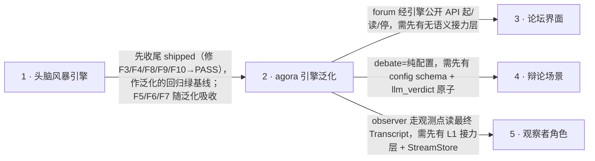

# Roadmap — agora

> **A decomposition, not a promise.** 整体想法拆成增量步骤：每步是什么、来源、大小、依赖、顺序与并行泳道。**无日期**（除 Shipped 历史）、**无评分**——顺序即优先级。每步的**解决方案**在其 `docs/features/<slug>/` spec，不在这里。

## Steps

| # | Step | Source | Size | Depends on | Status |
|---|---|---|:---:|---|
| 1 | **头脑风暴引擎（场景 1 · CLI）**——多角色按序接力、共享桌面（append-only 有序持久化）、人设私有记忆、四扩展点、`create/run/stop/export`。已实现并经 review PASS + ship：作为引擎泛化的回归基线（F5/F6/F7 随步骤 2 吸收） | `idea-brief.md §4 brainstorm / §7 步骤 1`；`docs/features/brainstorm/spec.md §4/§5`、`docs/features/brainstorm/changelog.md` | M | — | shipped |
| 2 | **引擎泛化：agora 接力层 + 原子接口 + 声明式配置**——把 `Role/Scheduler/StopCondition` 三协议降维成闭集原子（`LLM/render/parse/relay/StreamStore/StateStore`）+ `roles/select/stop` YAML schema；`repository.py` 拆 L1 store + L2 语义映射；brainstorm 改造成一个 YAML 配置跑通（吸收 F5/F6/F7）；ADR-0007 覆盖 ADR-0002 | `idea-brief.md §3 引擎 / §5 / §6 / §7 步骤 2`；`docs/features/brainstorm/_design/atomic-relay.md` | L | 1 | idea |
| 3 | **论坛界面（Web 表面）**——网页端发起/阅读/停止一场多角色讨论，真人只发起/观察/停止（不中途接入接力，§8 非目标仍约束本步） | `idea-brief.md §3 界面 / §4 forum / §7 步骤 3 / §8` | M | 2 | idea |
| 4 | **辩论场景（场景 2 · 零代码配置）**——`scenarios/debate.yaml` 配出 正/反 + 裁判（`round_robin` 交替 + `llm_verdict` 法官裁决），能力集合与 brainstorm 相同 → 纯配置、零引擎改动；兼作「零代码扩展」验收样例 | `idea-brief.md §4 debate / §7 步骤 4`；`atomic-relay.md §4 场景 B / §8.4` | S | 2 | idea |
| 5 | **观察者角色（不发言 · 总结/评分）**——在 relay 观测点读最终 `Transcript`，结束时产出总结/评分并作观测产出 | `idea-brief.md §4 observer / §5 观测 / §7 步骤 5` | S | 2 | idea |

## Dependency graph

## Execution path

| Wave | Steps | Zone per step（并行安全的依据） | Unlocks |
|:---:|---|---|---|
| 1 | 1 | `brainstorm/` 全包 + `docs/features/brainstorm/`（当前 `feature/brainstorm` 分支唯一活动区） | brainstorm 绿基线（review PASS + ship）→ 步骤 2 的回归锚 |
| 2 | 2 | 引擎核心面：`business/protocols.py`、`engine/*`、`weave_adapter/repository.py`、`config_loader.py`/`wiring.py`、`extensions/*` | agora 引擎泛化 → 场景零代码切换 → 同时解锁 3/4/5 |
| 3 | 3 ｜ 4 ｜ 5 | 3: `forum/` Web 表面（新顶层包） · 4: `scenarios/debate.yaml` + `docs/features/debate/`（配置数据层） · 5: `extensions/observers/`（新扩展代码，不改 relay 控制流）——互不相交 | 三层模型齐交付：界面 forum + 场景×2 brainstorm/debate + 观测 observer |

## Shipped

<!-- 历史：唯一允许日期的地方。 -->

| Step | Shipped | Link |
|---|---|---|
| 1 | 2026-09-03 | [changelog](features/brainstorm/changelog.md)（review PASS；PR 待开——无远程） |
